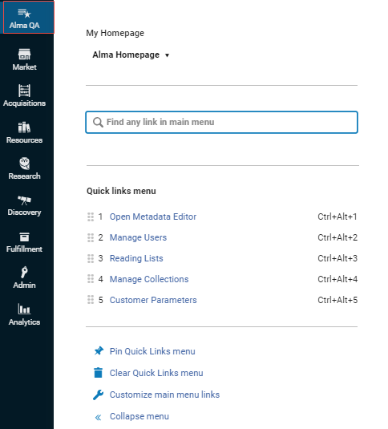
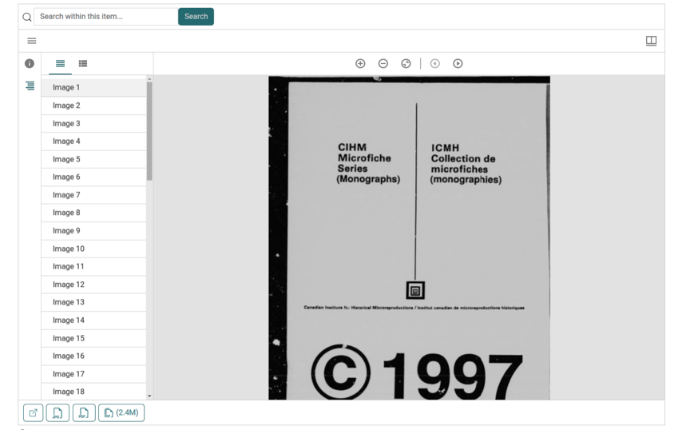

# Document Viewer UX and Accessibility

In the context of GLAM (Galleries, Libraries, Archives, and Museums) websites, a document viewer is a key tool for providing access to digitized historical collections and archival materials. The accessibility and usability of a document viewer are crucial for ensuring inclusive access and enabling all users, including those with disabilities, to effectively interact with and utilize the valuable digital resources.

## Generalized Recommendations

By conducting comprehensive usability and accessibility research on Mirador viewer, consulting industry partners such as [Digirati](https://digirati.com/) and [NYU Library's DLTS Team](https://library.nyu.edu/departments/digital-library-technology-services/), and reviewing [W3 Guidelines](https://www.w3.org/TR/coga-usable) for "Making Content Usable for People with Cognitive and Learning Disabilities", CRKN has compiled general recommendations for ensuring good usability and accessibility of document viewers, outlined below. Expand each recommendation to view supporting information and implementation tips.


<details>

<summary>Pay special attention to the ARIA best practices to best support individuals using screen readers. Including aria-live passive for announcing changes made to the UI while using the viewer, and aria-live assertive for errors.</summary>

* Ensure all interactable elements include [aria labels](https://developer.mozilla.org/en-US/docs/Web/Accessibility/ARIA/Attributes/aria-label) for screen readers.&#x20;
* Screen readers create dynamically generated summary of the page. Take advantage of [ARIA Landmark Roles](https://developer.mozilla.org/en-US/docs/Web/Accessibility/ARIA/Roles/landmark\_role) to create 'skip links' especially designed for users who are relying on screen readers.&#x20;
  * Adobe has created React-ARIA a wonderful library to help developers easily add ARIA features such as landmarks to their React components. [Check it out here](https://react-spectrum.adobe.com/react-aria/getting-started.html)!
* Make use of an [aria-live](https://developer.mozilla.org/en-US/docs/Web/Accessibility/ARIA/ARIA\_Live\_Regions) attribute is set on an empty element. When an update to the page occurs, the empty element with that aria-live attribute should be updated with a brief announcement informing the user an update has been made. The polite setting is ideal.&#x20;
* When creating table of contents, hierarchical displays and menus etc. make sure you implement [aria levels](https://developer.mozilla.org/en-US/docs/Web/Accessibility/ARIA/Attributes/aria-level) for people making use of screen readers.&#x20;


</details>

<figure><figcaption><p>See '<a href="https://web.dev/articles/hiding-and-updating-content">Web.dev</a>'</p></figcaption></figure>


<details>

<summary>Avoid displaying too much content at once on the screen at once. Even if your IIIF items are rich in data, only display the most essential information by default. </summary>

* Showing too much information can create confusion and make it harder for users to find basic functionality. Busy components with too much text, imagery, and other content can cause confusion, anxiety, and loss of focus.
* Some alternative strategies you can employ include: &#x20;
  * Provide users with no more than five main choices per screen and remove unnecessary content.&#x20;
  * Separate additional details into other web components or well-defined sections using whitespace, headings, shapes, displayed below the image viewer.  &#x20;
  * Keep extra links that don't relate to the main purpose of the viewer confined to the footer.&#x20;
  * Leverage expansion panel UI patterns to ensure efficient interaction for screen reader and keyboard users.
    * While expansion panels can be a space-saving solution, they can also make it difficult for some users to guess the content inside.&#x20;
    * Use consistent UI patterns to signal the presence of hidden content, such as:&#x20;
      * A "+" symbol to indicate expandable content.
      * Triangles next to sub-menu items.

</details>


<details>

<summary>Display the IIIF summary field prominently near the title of the IIIF manifest.</summary>

* This should help users quickly understand the purpose and content of the IIIF item.&#x20;
* When creating your manifests, ensure that you add a summary that can be understood by people with a lower secondary education reading level.&#x20;
* Emphasize key keywords and use common, everyday language in the summaries.&#x20;


</details>

<figure><figcaption><p>See '<a href="https://concordiauniversity.on.worldcat.org/search/detail/813921222?queryString=history&#x26;databaseList=&#x26;format=Book&#x26;subformat=Book%3A%3Abook_printbook&#x26;subformat=Book%3A%3Abook_digital&#x26;subformat=Book%3A%3Abook_thsis&#x26;subformat=Book%3A%3Abook_mic&#x26;subformat=Book%3A%3Abook_largeprint&#x26;subformat=Book%3A%3Abook_mss&#x26;changedFacet=format&#x26;clusterResults=true&#x26;groupVariantRecords=false">Concordia</a><a href="https://concordiauniversity.on.worldcat.org/search/detail/813921222?queryString=history&#x26;databaseList=&#x26;format=Book&#x26;subformat=Book%3A%3Abook_printbook&#x26;subformat=Book%3A%3Abook_digital&#x26;subformat=Book%3A%3Abook_thsis&#x26;subformat=Book%3A%3Abook_mic&#x26;subformat=Book%3A%3Abook_largeprint&#x26;subformat=Book%3A%3Abook_mss&#x26;changedFacet=format&#x26;clusterResults=true&#x26;groupVariantRecords=false">'s Library Search Portal</a>'</p></figcaption></figure>


<details>

<summary>Ensure your viewer has the important navigation options close to the start of the page, to help users relying on keyboard navigation to explore your item.</summary>

*   Important navigation options include:

    * Go to \<image number> selection/input&#x20;
    * First page button&#x20;
    * Next page button&#x20;
    * Previous page button&#x20;
    * Last page button&#x20;


</details>

<figure><figcaption><p>See '<a href="https://uv-v4.netlify.app/#?manifest=&#x26;c=&#x26;m=&#x26;cv=&#x26;xywh=-1913%2C-197%2C6393%2C3936">Universal Viewer'</a></p></figcaption></figure>


<details>

<summary>Avoid hiding important features or burying them in nested menus or "more" options. </summary>

* Keeping common and important features prominent, rather than hidden in dropdown menus or "more" options. This will increase the chances that all users can successfully complete tasks and navigate the image viewer.&#x20;
* Common features for our users are:
  * Full-text searching within the current item (if available)
  * Important navigation options
  * Download options&#x20;
  * Gallery/grid view&#x20;

</details>


<details>

<summary>Avoid displaying a long list of images before other functionality, because this can be problematic for users who navigate using a screen reader or keyboard tabbing. </summary>

* These users would have to listen to or tab through the entire manifest content before being able to interact with other features of the viewer.&#x20;
* Instead, consider:
  * Having canvas thumbnails towards the end of the interface, in a menu that is closed by default.
  * Providing an alternative way for users to access the list of images, such as through a selection menu. This will allow all users, including those relying on assistive technologies, to more easily access the other features and functionality of the image viewer.&#x20;
  * Ensure that with you enable up-and-down keyboard interactions with tab lists to allow users skip past, for example, a thumbnail list, in your tab list options. &#x20;

</details>


<details>

<summary>Offer skip links and/or a 'search-all' function to allow users to directly locate and skip-to the desired information in the viewer bypassing the need to navigate many context menus.</summary>

* Menu systems and most site navigation require the user to understand the menu categories.  In some cases, users know the correct category via memory, rather than logic. For example, most users remember that the print function is often found under the file menu. Users with impaired memory may not be able to find these menu items based on recall.&#x20;
* Users with impaired short-term memory, age related forgetfulness, or who are easily distracted may also find navigating a site and going to many pages to look for content difficult. If it takes too long, they may lose focus and forget what they are looking for.&#x20;


</details>

<figure><figcaption><p>See '<a href="https://uxmovement.com/navigation/why-motor-impaired-users-need-skip-links/">UX Movement</a>'</p></figcaption></figure>

<figure><figcaption><p>See '<a href="https://knowledge.exlibrisgroup.com/Alma/Product_Documentation/010Alma_Online_Help_(English)/010Getting_Started/050Alma_User_Interface_%E2%80%93_General_Information/The_Alma_User_Interface">ExLibris Alma</a>'</p></figcaption></figure>


<details>

<summary>Provide clear navigational aids, such as a table of contents and segmented content using ranges in your IIIF manifests, whether your manifest is a document or an audio/video recording.</summary>

* Provide a skip link to the table of contents or any segmented content (ranges) of a manifest close to the start of the page, but after the manifest title.&#x20;
* This will help users relying on screen readers and keyboard navigation get a good overview of the contents of the manifest, as well as aid them in quickly navigating to the information they are interested in. &#x20;
* For print materials:
  * The table of contents should list the major headings and subheadings, allowing users to quickly jump to the relevant sections.&#x20;
  * This is particularly helpful for users with attention or cognitive impairments, as they can easily return to a specific point in the document if they become distracted or lose their place.&#x20;
* For A/V content:
  * The table of contents should provide links or markers to different segments or "chapters" within the media. This allows users to easily navigate to the specific part of the audio or video they want to access, rather than having to scrub through the entire timeline. Aim for segments that are 6 minutes or less in duration, to accommodate neurodiverse users.&#x20;
  * If a transcript is available for the A/V content, users should be able to use them for navigation. Users should be able to click (or keypress) on a sentence navigate to the part of the video where it is spoken. This allows users to switch between the audio/video and the textual representation, providing greater accessibility and flexibility.&#x20;
  * Transcripts should also be available as full plaintext paragraphs.


</details>

<figure><figcaption><p>See '<a href="https://theseusviewer.org/?iiif-content=https://iiif.io/api/cookbook/recipe/0024-book-4-toc/manifest.json&#x26;collection=https://theseus-viewer.netlify.app/cookbook-collection.json">Theseus Viewer</a>'</p></figcaption></figure>

<figure><figcaption><p>See '<a href="https://www.latex-project.org/">LaTex</a>'</p></figcaption></figure>


<details>

<summary>If you have OCR information available, display it for the user before the image in the sequence of html elements, and ideally, provide a skip link to it.</summary>

* This will make the content of your viewer accessible for people making use of screen readers.&#x20;
* It is highly suggested for all institutions to make OCR representations of their items available whenever possible. Otherwise, you will implicitly be providing unequal access to your materials for visually impaired patrons.
* Ideally for images and other media, alternative textual descriptions would be given.
* Consider using aria-live="polite" to update the user on the textual representation of the content of the canvas being displayed as they navigate through the manifest.

```
<div class="image-viewer">
  <div id="transcription" aria-live="polite" class="sr-only">
    <!-- only visible to screen readers -->
   </div>
  <div id="open-seadragon" aria-describedby="transcription" role="img">
    ...
  </div>
</div>
```


</details>

<figure><figcaption><p>See '<a href="https://trove.nla.gov.au/">Trove</a>'</p></figcaption></figure>


<details>

<summary>Maintain a stable layout, avoiding unexpected shifts in the user interface. </summary>

* Sudden, unpredictable changes in the user interface can be highly disorienting, especially for users with cognitive or learning disabilities. Shifting controls, content, or layout can cause loss of focus, anxiety, and difficulty understanding or interacting with the interface.&#x20;
* For users with slow hand-eye coordination or impaired cognitive processing, even minor unexpected shifts in the position of controls can result in inadvertent, incorrect actions. This can further compound disorientation and confusion.&#x20;
* For larger screens, the side context menus should remain open and visible, maintaining a consistent layout. This ensures users can easily access the menu options without any disruptive content shifts.&#x20;
* Alternatively, if the context menus are designed to be collapsible, it should overlay the image content rather than shifting the image display when toggled. This preserves the user's context and prevents the focus (the image) from being unexpectedly rearranged.

<!---->

* Some other examples of problematic unexpected changes include:&#x20;
  * Automatic launching of new windows or pop-ups, and opening of new content or features without user initiation&#x20;
  * Form submissions triggered by means other than a clearly labeled submit button&#x20;
  * Changes in selected options or navigation paths, for instance, if new content appears and pushes down the information a user is currently reading.&#x20;

</details>


<details>

<summary>Use a combination of icon and label buttons instead of relying solely on icons.</summary>

* This makes the functionality clearer for all users, including those who are less technologically savvy. While icons can be visually appealing, words provide more explicit information about what each button does.&#x20;
* Additionally, ensure that:&#x20;
  * Labels are written in easy-to-understand language.
  * Place labels next to the relevant controls and ensure they are readable by assistive technologies.&#x20;

</details>

<figure><figcaption><p>See '<a href="https://adamsilver.io/blog/the-problem-with-tooltips-and-what-to-do-instead/">Adam Silver</a>'</p></figcaption></figure>


<details>

<summary>Avoid relying on tooltips to convey information. Use alternative UI patterns such as guided tours to teach users your viewer's functionality.</summary>

* Tooltips may not be accessible to all users, particularly those using touch-screen devices such as iPads.
* Many elderly individuals use tablets like the iPad as their primary computing device. For these users, tooltips that only appear on hover are not a reliable way to communicate functionality or provide context.&#x20;
* Instead, here are some alternative suggestions:&#x20;
  * Add clear, visible labels to describe the purpose and actions of interface elements. This ensures all users, including those on touch-screen devices, can understand the user interface without having to rely on hover-based tooltips.&#x20;
  * You can start by creating a good design for touch screens, and then adapting it to desktop. Adopting a mobile-first or tablet-first design approach will help you design user interfaces which are catered to these devices restrictions rather than relying on mouse interactions, and avoid the need for a completely different UI for desktop vs mobile.
  * Consider providing a single link that opens a modal or panel with a listing of the labels and what each means, like a glossary.
  * Implement an in-app [onboarding-tour](https://userpilot.com/blog/what-is-a-product-tour/) for first time users, and have a quick launch of the guided tour under a help menu, for returning users who need a refresh. This will help them learn what the various icons mean, without needing to rely on tooltips. For users with memory challenges, an easy way to re-launch this tour  will be important.

</details>

<figure><figcaption><p>See '<a href="https://www.appcues.com/use-case/user-onboarding-software">Appcues</a>'</p></figcaption></figure>


<details>

<summary>Build in customization options for various display settings.</summary>

* Take advantage of global settings already set by the user, and 'media queries' such as [prefers contrast](https://developer.mozilla.org/en-US/docs/Web/CSS/@media/prefers-contrast) and [forced colors](https://developer.mozilla.org/en-US/docs/Web/CSS/@media/forced-colors) in your style sheets to set defaults for users that need different color schemes.
* Prominently display a "Customize" button or link, making it easily accessible from the main interface. &#x20;
  * Sensory friendly settings would include:&#x20;
    * Neutral, muted color palettes rather than bright, saturated shades.&#x20;
    * No harsh contrasts and busy patterns that can be visually overwhelming.&#x20;
    * Clean, simple, sans-serif font styles.&#x20;
    * Minimize the use of animations, transitions, or other dynamic elements.&#x20;
    * Allow users to adjust spacing to their comfort level.&#x20;
    * Do not auto-play A/V content on page load as this can be overwhelming for neurodiverse individuals.&#x20;
  * For color blindness:  &#x20;
    * Configure high-contrast themes targeted for the various forms of color blindness.&#x20;
  * For people with low vision:&#x20;
    * Allow users to adjust font sizes.&#x20;
    * Allow them to adjust the weight of the font.&#x20;
  * For people with dyslexia:&#x20;
    * Allow configure the letter spacing, which will help them differentiate between letters.&#x20;
  * For people with dyscalculia:&#x20;
    * Avoid using symbolic representations of numbers, e.g. use the word ‘nine’ instead of ‘9.’&#x20;
    * Do not use percentage signs to indicate progression of how many pages were read or how far someone is in a video, but rather use indicator bars like ‘YouTube’ videos.&#x20;

</details>


<details>

<summary>Make all labels for buttons, headers, IIIF metadata, and other interface elements configurable. </summary>

* This is especially important for IIIF related concepts, which may use technical or domain-specific language that could be confusing for some patrons.
* This allows institutions to customize the descriptive data shown about their items to better suit the needs and expectations of their unique patrons.
* By making labels configurable, institutions can ensure the terminology and language used aligns with what their users are familiar with.
* For example, a university library may want to use more academic-focused language for their IIIF image viewer, while a public library may prefer more general, user-friendly terms.&#x20;

</details>


## Supporting Research

### Project Background

CRKN members include 85 institutions across Canada spanning world-class academic, public, and national libraries as well as research institutions. Our members support open access of Canadian heritage through our Canadiana Access Platform.&#x20;

Two of our most important access collections are [Canadiana ](https://www.canadiana.ca/)which includes digitized historical publications, and [Héritage](https://heritage.canadiana.ca/), which features handwritten archival materials and is a collaboration between CRKN and Library and Archives Canada (LAC.)

As part of a mandate of adopting and contributing to open-source, community developed, software, CRKN is switching to the [International Image Interoperability Framework (IIIF)](https://iiif.io/) as our central data model for our holdings. IIIF is a central to our plan of simplifying our infrastructure, leading to features for better supporting alternative access methods. The switch to a IIIF data model for our access objects allows CRKN to take advantage of existing software to replace in-house developed solutions.&#x20;

As part of this transition, CRKN elected to replace their custom image viewing solution with an open-source community developed solution, [Mirador Viewer](https://projectmirador.org/).

### Research Objective

To assess the accessibility and usability of the Mirador Viewer, an open-source community-developed document viewer, for Canadiana users with different accessibility needs, including those with cognitive and physical disabilities. The goal is to identify specific issues and gaps in the base Mirador code that need to be addressed to improve the accessibility and user experience for a diverse set of users.

The study aims to capture detailed feedback from an accessibility user panel, consisting of individuals with a range of disabilities, as well as a panel of existing Canadiana users, on their ability to perform key tasks in the Mirador Viewer. The findings will be used to inform specific actionable tasks and GitHub issues to be addressed by the Mirador development community, as well as configuration changes that CRKN can make to improve the accessibility and usability of the viewer. A set of generalized recommendations for digital object viewers will also be outlined, with collaboration with other GLAM community members, for the broader benefit of all GLAM institutions.

### Recruitment

CRKN partnered with [Access Changes Everything Inc.](https://www.linkedin.com/in/sniderdigitalaccessibility/) (ACE) to recruit a panel of test users with different accessibility needs, including persons with both cognitive and physical disabilities.&#x20;

Next, we created a brief, simple survey that Canadiana users could complete in their first few minutes of accessing the site, that would garner CRKN basic information about who Canadiana researchers are and where their interests lie, as well as email addresses for follow-up studies.&#x20;

The survey was launched in late November 2023 as a pop-up on the Canadiana site, using Survey Monkey. The survey was available in both English and French, and these translations were automatically presented on the English and French sides of the Canadiana site respectively.&#x20;

The survey consisted of the following three questions:&#x20;

***

Please tell us about yourself. I am a... (select all that apply)&#x20;

1. Genealogical researcher&#x20;
2. GLAM professional&#x20;
3. Government employee&#x20;
4. Legal researcher&#x20;
5. Member of the general public&#x20;
6. Post-secondary researcher&#x20;
7. Student&#x20;
8. Teacher&#x20;
9. Other (please describe)&#x20;

What field(s) of research are you most interested in? (select all that apply)&#x20;

1. Computer science&#x20;
2. Digital Humanities&#x20;
3. Education&#x20;
4. Environment/Climate&#x20;
5. Gender Studies&#x20;
6. Genealogy&#x20;
7. Geography&#x20;
8. Health&#x20;
9. History&#x20;
10. Indigenous Land Claims&#x20;
11. Indigenous Studies&#x20;
12. Information Science&#x20;
13. Law&#x20;
14. Linguistics&#x20;
15. Literature&#x20;
16. Political Science&#x20;
17. Other (please specify)&#x20;

Thank you for taking the survey! Are you interested in helping us improve Canadiana through focus groups and/or feature testing? Please input your email here. You can also reach out to us at [info@crkn.ca](mailto:info@crkn.ca)&#x20;

***

<figure><figcaption></figcaption></figure>

The survey had a consistently high response rate throughout the time it was open. The English translation of the survey received a gross total of 11,924 responses, and the French translation received a gross total of 1,306 responses.

Over a four hundred respondents elected to send us their contact information for UX testing.

### Accessibility Testing

The first step in our adoption of Mirador was to assess its current accessibility level.&#x20;

To get a correct judgement of what work needed to be done to the Mirador base-code for improving accessibility, we set up an instance that was as close as possible to the Mirador 3 default settings for a single window. You can see the configuration options for the Mirador 3 viewer used in the test [here](https://github.com/crkn-rcdr/demo-blacklight/blob/7b792b5cdfcb8cad8850a54850fff14e5eb3f7c1/app/javascript/controllers/iiif\_viewer\_component\_controller.js).

On this version of our Mirador instance (see image below) we had the ACE accessibility user panel test the interface, and report back any issues they had while performing a robust set of tasks.&#x20;

<figure><figcaption></figcaption></figure>

The panel of users who tested Mirador viewer included the following:

* An auditor, who is fully blind, and used Windows 10 using JAWS 2024 Home Edition on EDGE browser.&#x20;
* An auditor, who is Deaf-Blind, and used iPad Pro 9th generation with iPadOS 17.2 with Focus 40 Blue 4th generation braille display and VoiceOver using Safari.&#x20;
* An auditor, almost fully blind, and used iPhone 14 Pro, using iOS 17.2 Safari browser and VoiceOver screen reader.&#x20;
* An auditor, who has ADHD, and used MacBook Air M2 (2022) using Safari version 16.5 with no other technology.&#x20;
* An auditor, who is fully blind, and used iPhone 14, OS 17.1.2, Safari and VoiceOver screen reader.&#x20;
* An auditor, who is Deaf-Blind, and used iPhone 13 Pro Max with iOS 17.2 using the Focus 14 Blue 4th generation and VoiceOver with Safari.&#x20;
* An auditor, who is almost fully blind, and used Windows 10 with Windows Narrator on EDGE.
* An auditor, who has low vision, and used Apple Mac Mini (M1, 2020) running MacOS 13.4.1(c) using Safari, with 27” external monitor. Increased display contrast is on, and output is set at 1280 by 720 px. Increased zoom employed when needed.&#x20;
* An auditor, who is Deaf-Blind, and used Windows 11 laptop using JAWS 2020, and PacMate 20 braille display with Chrome.&#x20;
* An auditor, who is almost fully blind, and used Windows 10, using NVDA 2022.4 on Chrome browser Version 107.0.5304.110.
* An auditor, who is Deaf-Blind, and used Windows 10 with JAWS 2019 and Focus 14 braille display with Chrome. &#x20;

Raw feedback from each auditor was captured and grouped into clusters representing the specific area of the user interface it pertained to.

This was an activity which would aid us in developing specific actionable tasks to address accessibility concerns.&#x20;



Based on the clusters created, twelve issues were opened in the Mirador GitHub Repository, as these issues would need to be resolved by base-code changed to Mirador.&#x20;

* [#3877](https://github.com/ProjectMirador/mirador/issues/3877) - Icons for various functions not indicative of purpose of function&#x20;
* [#3878](https://github.com/ProjectMirador/mirador/issues/3878) - Jarring content shift when toggling sidebar
* [#3879](https://github.com/ProjectMirador/mirador/issues/3879) - Mirador incompatible with JAWS 2019 (Needs Confirmation)
* [#3880](https://github.com/ProjectMirador/mirador/issues/3880) - Navigation between menus and tabs difficult for users with screen readers
* [#3881](https://github.com/ProjectMirador/mirador/issues/3881) - Screen readers do not indicate an image is displayed in OpenSeadragon canvas area
* [#3882](https://github.com/ProjectMirador/mirador/issues/3882) - Not enough screen reader feedback when selecting an image from sidebar lists
* [#3883](https://github.com/ProjectMirador/mirador/issues/3883) - Not enough screen reader feedback when toggling sidebar
* [#3884](https://github.com/ProjectMirador/mirador/issues/3884) - Screen readers do not announce the selection of images in the side menu
* [#3885](https://github.com/ProjectMirador/mirador/issues/3885) - Screen readers do not announce effects of zoom buttons
* [#3886](https://github.com/ProjectMirador/mirador/issues/3886) - Current image index and number of images is not clear for users with screen readers

Additionally, five observations were made relating to plugins or settings in Mirador, which could be changed directly by CRKN to provide a more accessible experience. Expand the sections below to see the supporting information for the corresponding observation.

<details>

<summary>Users had significant difficulty using the download functionalities</summary>

* DEAF-BLIND – iPhone 13 Pro Max/iOS 17.2/Focus 14 Blue 4th gen/VoiceOver/Safari - Thought the document was a PDF after scrolling down and reading the download buttons. (Commented on misleading labeling, as the file should be identified as a PDF instead of just images)&#x20;

<!---->

* DEAF-BLIND – iPhone 13 Pro Max/iOS 17.2/Focus 14 Blue 4th gen/VoiceOver/Safari - Suggested making download the PDF for alternative access a feature&#x20;

<!---->

* DEAF-BLIND – Windows 10/JAWS 2019/Focus 14 braille/Chrome - Confusion with buttons and links for JPG and PDF downloads.&#x20;

<!---->

* DEAF-BLIND – Windows 11/laptop/JAWS 2020/PacMate 20 braille/Chrome - Successful JPG download but confusion with two buttons for PDF&#x20;

<!---->

* LIMITED SIGHT – Apple Mac Mini M1 2000/MacOS 13.4.1/27” external monitor/Increased contrast /1280 by 72px/zooming - Download option located at the bottom of the page; suggested having download buttons in the top bar for easier access. Difficulty finding the download option; small text required zooming in; understanding the buttons after hovering over them&#x20;

<!---->

* LIMITED SIGHT – Apple Mac Mini M1 2000/MacOS 13.4.1/27” external monitor/Increased contrast /1280 by 72px/zooming - Visibility issue distinguishing between JPG and PDF download options&#x20;

<!---->

* LIMITED SIGHT – Apple Mac Mini M1 2000/MacOS 13.4.1/27” external monitor/Increased contrast /1280 by 72px/zooming - Difficulty finding download buttons in the bottom left corner. Suggested placement in the top main control section.&#x20;

<!---->

* LIMITED SIGHT – Windows 10/NVDA 2022.4/ Chrome - Download button starting with the document size is confusing&#x20;

<!---->

* LIMITED SIGHT – iPhone 14 Pro/iOS 17.2/VoiceOver/Safari - Pressing "open full-sized image in new tab" only labeled as "image" by VoiceOver.&#x20;

<!---->

* DEAF-BLIND – Windows 11/laptop/JAWS 2020/PacMate 20 braille/Chrome - Issues with the download area, particularly the full PDF download saving as a Chrome download instead of a PDF. Lack of clarity on how to open the downloaded PDF&#x20;

<!---->

* DEAF – BLIND – Ipad Pro 9/iPadOS 17.2/Focus 40 Blue 4th gen/VoiceOver/Safari - It is unclear which page the link to open an image in a new tab will open&#x20;

</details>

<details>

<summary>The thumbnail list provided an uneven experience to users depending on their accessibility needs</summary>

* LIMITED SIGHT – Apple Mac Mini M1 2000/MacOS 13.4.1/27” external monitor/Increased contrast /1280 by 72px/zooming - Preferred the thumbnail list as the default  &#x20;

<!---->

* LIMITED SIGHT – Apple Mac Mini M1 2000/MacOS 13.4.1/27” external monitor/Increased contrast /1280 by 72px/zooming - Not much difference noticed after moving thumbnails to the bottom.&#x20;

<!---->

* LIMITED SIGHT – Windows 10/Windows Narrator/EDGE - Difficulty differentiating the list and thumbnail tabs. Thumbnails, when moved to the bottom or side, appeared as a list of buttons below the digitized viewer, regardless of the selection of tab, making it challenging for Narrator to distinguish.&#x20;

<!---->

* DEAF-BLIND – Windows 10/JAWS 2019/Focus 14 braille/Chrome - Thumbnails list appears identical to the page list&#x20;

<!---->

* DEAF-BLIND – Windows 11/laptop/JAWS 2020/PacMate 20 braille/Chrome - Encountered issues switching between tabs, getting stuck in the first one.&#x20;

</details>

<details>

<summary>The previous and next buttons are the preferred mechanism to use as primary navigation</summary>

* LIMITED SIGHT – Apple Mac Mini M1 2000/MacOS 13.4.1/27” external monitor/Increased contrast /1280 by 72px/zooming - Took a few minutes to know how to toggle the sidebar.

<!---->

* DEAF-BLIND – iPhone 13 Pro Max/iOS 17.2/Focus 14 Blue 4th gen/VoiceOver/Safari - Prev and next buttons when toggling sidebar allowing for easier movement within the document in comparison to sidebar&#x20;

<!---->

* DEAF – BLIND – Ipad Pro 9/iPadOS 17.2/Focus 40 Blue 4th gen/VoiceOver/Safari - Discovered that toggling the sidebar adds previous and next buttons, allowing easier navigation.&#x20;

<!---->

* LIMITED SIGHT – Windows 10/Windows Narrator/EDGE - Sidebar toggle was readable to Narrator and turning off thumbnails made navigation less confusing.&#x20;

</details>

<details>

<summary>The 'resource' label in the information side panel can be confusing for those with screen readers</summary>

* LIMITED SIGHT – Windows 10/NVDA 2022.4/ Chrome - In the Information area, a heading level 5 ("Resource Guide to the Document") isn't recognized as a link by NVDA; clicking it has no effect.&#x20;

<!---->

* LIMITED SIGHT – iPhone 14 Pro/iOS 17.2/VoiceOver/Safari - Clicking on a heading level 5 ("Resource guide to beekeeping in British Columbia") has no effect.&#x20;

<!---->

* LIMITED SIGHT – Windows 10/Windows Narrator/EDGE - Unable to click on the link in the resource area using Narrator.&#x20;

<!---->

* LIMITED SIGHT – iPhone 14 Pro/iOS 17.2/VoiceOver/Safari - No link indication in the resources section.&#x20;

</details>

<details>

<summary>Triggering zooming in the image display through the mouse wheel scrolling and finger scrolling led to frustration, as users needed to access page elements below the image display</summary>

LIMITED SIGHT – Apple Mac Mini M1 2000/MacOS 13.4.1/27” external monitor/Increased contrast /1280 by 72px/zooming - Disliked zooming in when scrolling in the main image area. Frustration with having to go to the edge of the screen to scroll down.&#x20;

</details>

### Usability Testing

Fixes were applied to address the five accessibility issues listed above, that could be remediated through Mirador configuration options and settings, as outlined below.

* Users had significant difficulty using the download functionalities.
  * Searchable PDF versions of our items have been determined to be the best mode of access for people with assistive technology. (It is recommended that we prioritize OCR of all content in our access platforms.)​
  * The PDF version of the item was changed from a pdf button at the bottom of the viewer to a ‘Download Searchable PDF (size)’ button directly after the title of the item. Additionally, for users with screen readers, the following text will be read aloud to them, after this button: ‘Downloading the searchable PDF is the recommended mode of access for people using assistive technologies.’ ​
  * All reference to ‘images’ occurs after this point – it was not clear to the users that this was an image viewer, so effort was made to change labelling and group functions references images into the main viewer. ​
  * A new plugin was created to allow the user to download the current image as a jpeg, or searchable PDF. Upon clicking the respective files are downloaded. ​
  * Other resolution options were also added to this menu via the open source mirador downloads plugin. ​
  * Finally, the open-source PDIIIF plugin was added to the ‘...’ menu labelled as ‘Print Images to PDF.’ This was kept separate from the single image downloads since it can be used for the entire document. Effort was made to make it clear to the user that the resulting PDF will not be searchable. Locating this print option in the ‘...’ menu follows standard navigational practices for software.&#x20;
* The thumbnail list provided an uneven experience to users depending on their accessibility needs
  * It was found that the canvas list tab on the left-side of the default mirador layout was redundant and caused the users to have to tab through the canvas list before interacting with any following content.​
  * The left-side menu was edited to only include information about the item – the canvas list was completely removed from the UI on the left-side.​
  * Users can enable thumbnail list navigation through the ‘Window views and thumbnail display’ menu option. It is kept off by default to better support keyboard navigation.​
* The previous and next buttons are the preferred mechanism to use as primary navigation.
  * Users can enable thumbnail list navigation through the ‘Window views and thumbnail display’ menu option. It is kept off by default to better support keyboard navigation.​
  * Removed canvas listing from the left side menu, which removes a lot of keyboard tabbing before being able to interact with the previous and next buttons. ​
* The 'resource' label in the information side panel can be confusing for those with screen readers.
  * It was found that the info section labels made the viewing experience confusing. Labels were changed:​&#x20;
    * ‘Current Item’ has become ‘Current Image’​&#x20;
    * ‘Resource’ has become ‘Item Title’
  * These changes also further indicate the nature of the viewer as an image viewer showing the images related to a historical item.​
* Triggering zooming in the image display through the mouse wheel scrolling and finger scrolling led to frustration, as users needed to access page elements below the image display.
  * It was found that zooming on scrolling over the viewer was an accessibility concern, as well as a UX concern for accessing content below the viewer. Therefore, we disabled zoom on scroll for the viewer.​

These changes resulted in the following design for a 'more accessible' version of Mirador. You can see the configuration options for the Mirador 3 viewer used in the test [here](https://github.com/crkn-rcdr/demo-blacklight/blob/9bde50f3fb587bbe45044646a6439088e55530d3/app/javascript/src/modules/m3\_viewer.js).

<figure><figcaption></figcaption></figure>

To determine any general usability issues with the 'more accessible' design shown above, and to ensure that introducing this new viewer would be seen as a positive change by our existing users, CRKN held unmoderated usability sessions using [Maze](https://maze.co/) on the 'more accessible' design.&#x20;

The usability tests included the following ten tasks, which were to be completed within a 30-minute session.

1. Navigate to the second image of the document.&#x20;
2. Zoom into the second image and read a specific paragraph.&#x20;
3. Locate a list of contributors or authors for the item.&#x20;
4. View all the images at once in a gallery view. &#x20;
5. Navigate to the 33rd image.&#x20;
6. Search for the word ‘bee’ in the text and record the full sentence of the third search result. &#x20;
7. Download the entire document in a single PDF.&#x20;
8. Try printing only images 1, and 4 through 6 as a PDF.&#x20;
9. Edit the brightness of the image.&#x20;
10. Turn on the thumbnail list navigation feature.&#x20;

For each of these tasks, Maze allowed us to configure the expected path a user should have taken to complete the task successfully. Maze tracked inputs and mouse movements, missed clicks, heatmaps, etc. Maze also kept recordings wherein we will ask the participant to talk aloud as they work on a task. For each task, Maze collected the following KPIs: success rate, time-on-task, and user error rate.&#x20;

We had thirty-three participants in total who successfully completed the study.

The following System Usability Score (SUS) was calculated for the 'more accessible' version of Mirador: 70.25. A SUS score above a 68 would be considered above average and anything below 68 is below average. Therefore, the SUS score was found to be average for the mostly ‘vanilla’ Mirador viewer with the settings changes applied, with a confidence level of 2/3 according to Maze.io. A higher confidence level could be attained by receiving 100 or more responses.

Through analyzing the recordings of each test participant, taking note of what was said aloud as well as mouse movements, the following observations and suggested remediations were developed. A severity level was assigned to each pain-point based on the number of users who had difficulties completing the task, and the level of confusion indicated by each individual test user when completing the task. &#x20;

* Users had trouble locating the Gallery ​view (Severity 3)&#x20;
  * The single and gallery views were retained, but the functionality to toggle between the views was added to the main toolbar menu, rather than hidden in a drop-down menu.&#x20;
* Users expressed the desire for a quick (and accessible) way to nav through images that is always visible​ (Severity 3)&#x20;
  * A Mirador plugin was implemented to re-introduce a drop-down menu for quick image selection, additionally offering a search functionality  to reduce the number of options displayed to the user for selection.
  * Added go to first and go to last buttons.
* Users had difficulty noticing the next and previous buttons (Severity 2)&#x20;
  * Used bolder and bigger next and previous buttons and grouped navigational buttons to the left-hand side of the toolbar for users to notice them more quickly.
* Users often went to the 'current image download' menu first when asked to download manifest as PDF​  (Severity 2)&#x20;
  * For users taking advantage of screen readers, keep the download searchable pdf and note about this being the best experience for screen readers visible. For all other users, hide this link to reduce the number of download icons on the page.​
* Tooltips do not render on tablet and mobile​ (Severity 2)&#x20;
  * Modifications were made so that tooltip text is utilized less for explanatory information. Tooltips require hover functionality, and as many users access websites through tablets and mobile devices, where the hover function is not available, the benefit of tooltips is void. Efforts will be made to select clear icons or use text labels where needed. &#x20;
* Users are unsure if PDIIIF downloads completed​  (Severity 2)&#x20;
  * The PDIIIF plugin was enhanced for better confirmation of download, as it was not clear that the file has been created for the user when the progress bar reached 100%.&#x20;
* Thumbnail display is not desired in comparison to Gallery, remove to reduce viewer complexity​ (Severity 1)&#x20;
  * The thumbnail strip navigation will be removed to reduce the number of options displayed to the user, as the same functionality is obtained in the gallery view, which was a more desired feature to our end users than a thumbnail strip.
* The info panel showed redundant information, but took up space, and added more links and buttons for the users to search through, when looking for a specific functionality.​ (Severity 1)&#x20;
  * To save space on the screen the info sidebar was removed, in preference for this information showing below the viewer. &#x20;

The changes outlined above resulted in the following design for the CRKN Mirador viewer. You can see the code for this Mirador viewer [here](https://github.com/crkn-rcdr/demo-blacklight/blob/digital-ocean/app/javascript/src/modules/m3\_viewer.js). Code for plugins used by the viewer are accessible [here](https://github.com/crkn-rcdr/demo-blacklight/tree/digital-ocean/app/javascript/src/plugins).&#x20;

<figure><figcaption></figcaption></figure>

For discovery of pain-points, it was found that the analysis of screen recordings and verbal output of test users was most useful. This was for multiple reasons. Test users often explored unrelated areas of the interface during a specific task, which would skew the recorded 'average time on task' KPI collected by Maze. Additionally, mouse movements were found to be very helpful in understanding where our users thought a specific functionality might be. By analyzing the recordings manually, we could develop a more accurate understanding of the experience of our users. &#x20;

One enhancement that could be made to future studies is putting an emphasis on staying on-task during the usability test, to ensure automated heat maps and KPIs remain more useful for analysis.

This version of the CRKN Mirador viewer will be included in open beta testing of our new access platform as we head into Q4 of 2024. Further feedback will be gathered from end users and stakeholders via this open beta testing. CRKN will also work towards ensuring the full suite of recommendations outlined are implemented in our viewer.

## Community Participation

GLAMs are known for their digital innovation, yet many, especially smaller institutions, face challenges in making their online services user friendly and accessible because of limited budgets, resources, and in-house expertise.  Pooling our resources and expertise to enhance the accessibility and UX of IIIF software will make it easier for all users to explore our digital collections. Advocacy for accessibility and UX within the community is another important factor that will lead to the prioritization of much needed enhancements.

Through the Mirador Community Calls, CRKN presented the findings of our accessibility and usability tests to the Mirador Group. This group included people from Harvard, Stanford, NYU, Universität Leipzig and more. Since CRKN tested Mirador version 3, there was some discussion about how to confirm that the issues we opened would still be relevant in version 4, with NYU volunteering to verify the issues are still present in Mirador version 4.&#x20;

The Mirador repository also included additional UX and Accessibility issues that were not created by CRKN as a result of this study. To address the issues created by CRKN as well as existing issues, an ['Accessibility + UX' project](https://github.com/orgs/ProjectMirador/projects/4/views/1) was created on GitHub.&#x20;

CRKN and NYU are processing the related issues into actionable development tickets, and populating the project. Development time will be allotted to the issues within the project upon final release of Mirador version 4. CRKN has also received access to contribute to Mirador Base code on GitHub.
