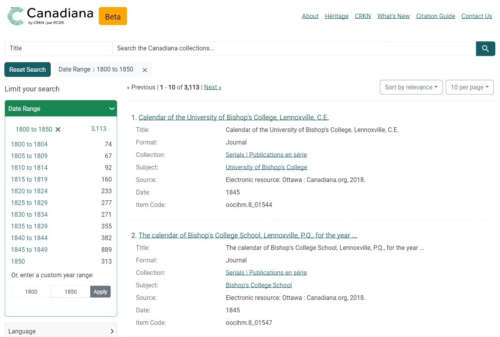

# Study: Blacklight Search UX

## Introduction

An evaluation of the default [Blacklight ](https://projectblacklight.org/)search interface, branded for [CRKN's Canadiana collection](https://www.crkn-rcdr.ca/en/about-canadiana-collections), was conducted in late 2024. The aim was to identify usability issues and enhance the user experience as CRKN transitions from the existing [Canadiana Access Platform (CAP)](https://www.canadiana.ca/) to a new Blacklight-based system. This report summarizes the findings from usability testing involving diverse target groups, including genealogical researchers, GLAM professionals, and post-secondary students.

## Object of Evaluation&#x20;

The object of evaluation was the default Blacklight search interface, with CRKN-Canadiana branding applied, carried out in late 2024 by the CRKN team. See the figures below.&#x20;

<figure><figcaption>
Figure 1: Description
</figcaption></figure>

***

<figure><figcaption>
Figure 2: Description
</figcaption></figure>

***

<figure><figcaption>
Figure 3: Description
</figcaption></figure>

***

<figure><figcaption>
Figure 4: Description
</figcaption></figure>

## Evaluation Method&#x20;

This test was conducted as an unmoderated think aloud usability test with the online usability testing software, [Maze](https://maze.co/). As this was an unmoderated usability test, the users were not observed live while they carried out the tasks. Instead, their interactions with the website and their verbal comments were recorded for later analysis. Users were recruited from our voluntary pool of existing Canadiana users, as well as a group of seminar students from a university level history course. &#x20;

Each participant individually carried out tasks on the Canadiana-Blacklight website during their usability test session. At the end of their usability test session, the participants answered a [System Usability Score (SUS)](https://www.interaction-design.org/literature/article/system-usability-scale?srsltid=AfmBOorRvc7DE1V7HG-WOUK0L-lC3DzARvOXSOfh545IKjQVvfiEfZBw) questionnaire of pre-defined questions and had the opportunity to submit any comments in a final open-ended question. Subsequently, the captured video recordings were analyzed by the author. The evaluation is based on an analysis of these videos from 24 unmoderated usability test sessions. The total time for each usability test session including answering questions was less than 30 minutes.&#x20;

## Data Captured

### Task 1

**Instructions:** Search for the term, Maple Leaf

**Expected answer:** Users were expected to type the search term, Maple Leaf, as prompted in the search box and press the magnifying glass icon-button to initiate the search.



<table data-view="cards"><thead><tr><th></th><th></th><th data-hidden data-card-cover data-type="files"></th></tr></thead><tbody><tr><td>Average Time on Task</td><td><strong>16 seconds</strong></td><td><a href=".gitbook/assets/3688427_hourglass_sand_sandtimer_timer_alarm_icon (7).png">3688427_hourglass_sand_sandtimer_timer_alarm_icon (7).png</a></td></tr><tr><td>Task Success Rate</td><td><strong>97%</strong></td><td><a href=".gitbook/assets/473803_achievement_arrow_goal_marketing_objective_icon.png">473803_achievement_arrow_goal_marketing_objective_icon.png</a></td></tr></tbody></table>



<table><thead><tr><th width="104">User # </th><th width="173">Completion Status </th><th width="151">Elapsed Time </th><th>Notes </th></tr></thead><tbody><tr><td>1</td><td>Success</td><td>8s</td><td>N/A</td></tr><tr><td>2</td><td>Success</td><td>15s</td><td>
User assumed pressing enter would initiate search 

User provided general feedback on all features after succeeding in the search: 
<ul><li>Item code [id] not necessary to show in the result listing </li><li>Author [creator] should be shown in the result listing </li><li>Limit the date ranges to only ones with results - Do not show facet values with 0 items. </li><li>[numerical sort preferred] rank languages and show relevancies </li></ul></td></tr><tr><td>3</td><td>Incomplete – difficulty with Maze software</td><td>N/A</td><td>Screen size error with Maze</td></tr><tr><td>4</td><td>Success</td><td>20s</td><td>Noticed the search field drop down beside the search bar</td></tr><tr><td>5</td><td>Success</td><td>30s</td><td>No recording to analyze</td></tr><tr><td>6</td><td>Success</td><td>11s</td><td>N/A</td></tr><tr><td>7</td><td>Success</td><td>6s</td><td>User noted the search field drop down was new/wanted it to default to All fields</td></tr><tr><td>8</td><td>Success</td><td>10s</td><td>Noted that we might need to make it more obvious what kind of item each item is in the search result – article, book…</td></tr><tr><td>9</td><td>Success</td><td>11s</td><td>
Continued using the UI after task was complete.  

 

Was not obvious that a series in the search listing would go a page which lists items in the series – noted we need to make this clearer in the search listing [what type of result it is and what that means – the user expected to be clicking the search result and seeing a page with an item viewer.] 

 

Noted they liked the new viewer (Mirador.)
</td></tr><tr><td>10</td><td>Success</td><td>9s</td><td>N/A</td></tr><tr><td>11</td><td>Failure</td><td>50s</td><td>Used the full text drop down for the search bar – not all fields.</td></tr><tr><td>12</td><td>Success</td><td>20s</td><td>
Read the navbar before navigating to the search bar. 

 

Said “Serials– oh It is a journal” – indicating it was not obvious what kind of item they were looking at from the search results listing. Then they said, “I see It is a journal but also It is a title and subject.” 

 

“This one seems to be bilingual” – noting the marc record subjects. 

Continued to navigate through the pages – a slower performance either because of the user’s internet speed or multiple users being on the demo site. This was an opportunity to see that loading indicators would be helpful for slow internet speeds in general, even when selecting the next page etc. 

 

“It is a good collection.”
</td></tr><tr><td>13</td><td>Success</td><td>10s</td><td>
Continued to use the interface after searching. 

 

Noted the “Eskimo languages” – people don't like that word, need to update what is listed there. 

 

Noted that the metadata was very detailed. 
</td></tr><tr><td>14</td><td>Success</td><td>-</td><td>No recording to analyze – no sound – continued to use UI during task so unable to give time estimate.</td></tr><tr><td>15</td><td>Success</td><td>11s</td><td>
Liked the crisp design. 

 

Indicated they are a researcher. 
</td></tr><tr><td>16</td><td>Success</td><td>14s</td><td>N/A</td></tr><tr><td>17</td><td>Success</td><td>16s</td><td>N/A</td></tr><tr><td>18</td><td>Success</td><td>13s</td><td>N/A</td></tr><tr><td>19</td><td>Success</td><td>12s</td><td>They indicated they like the field drop down beside the search bar.</td></tr><tr><td>20</td><td>Success</td><td>-</td><td>
No recording to analyze. 

 

Could not determine length of time through screenshots. 
</td></tr><tr><td>21</td><td>Success</td><td>20s</td><td>N/A</td></tr><tr><td>22</td><td>Success</td><td>16s</td><td>N/A</td></tr><tr><td>23</td><td>Success</td><td>21s</td><td>N/A</td></tr><tr><td>24</td><td>Success</td><td>17s</td><td>N/A</td></tr></tbody></table>




### Task 2

**Instructions:** Show 100 items per page in the search

**Expected answer:** The users were expected to move below the search bar and locate the drop-down component, which indicates the current number of items displayed in the search results. They were then expected to click this component, which would open the full list of values: 10, 20, 50, and 100 items. Then, they were expected to click the last item, 100, which would reload the search page with 100 results in the first page of the search listing.



<table data-view="cards"><thead><tr><th></th><th></th><th data-hidden data-card-cover data-type="files"></th></tr></thead><tbody><tr><td>Average Time on Task</td><td><strong>31 seconds</strong></td><td><a href=".gitbook/assets/3688427_hourglass_sand_sandtimer_timer_alarm_icon (3).png">3688427_hourglass_sand_sandtimer_timer_alarm_icon (3).png</a></td></tr><tr><td>Task Success Rate</td><td><strong>91%</strong></td><td><a href=".gitbook/assets/173878413041721978.png">173878413041721978.png</a></td></tr></tbody></table>



<table><thead><tr><th width="119">User # </th><th width="178">Completion Status </th><th width="167">Elapsed Time </th><th>Notes </th></tr></thead><tbody><tr><td>1 </td><td>Success </td><td>7s </td><td>Lag between showing results after pressing 100 in drop down caused confusion – no loading indicator. </td></tr><tr><td>2 </td><td>Success </td><td>15s </td><td>
Loading was not obvious [same for every user.] 

 

Slow speed noted. 
</td></tr><tr><td>3 </td><td>Incomplete – difficulty with Maze software </td><td> </td><td>Screen size error with Maze. </td></tr><tr><td>4 </td><td>Success </td><td>40s </td><td>
Loading was not obvious [same for every user.] 

 

Tried three times because of loading lag. 
</td></tr><tr><td>5</td><td>Success </td><td>15s </td><td>No recording to analyze. </td></tr><tr><td>6 </td><td>Failure </td><td>20s </td><td>Misunderstood the instructions, instead, they used the result listing numbering to find the 100th item in the list. </td></tr><tr><td>7 </td><td>Success </td><td>30s </td><td>
Location was immediately obvious to user. 

 

User clicked 100 multiple times, because loading was not obvious. 
</td></tr><tr><td>8 </td><td>Success </td><td>30s </td><td>They first said they do not know how to do that, then they found the drop down, but noted the lack of responsivity. </td></tr><tr><td>9 </td><td>Success </td><td>60s </td><td>
Immediately went but noticed the lag and thought it was not applied, so tried to select 100 - 5 times until eventually the page responded. 

 

Continued to use the UI at 100 items per page, slow performance. 
</td></tr><tr><td>10 </td><td>Success </td><td>30s </td><td>Cursor moved immediately; lack of loading made them use multiple times assuming it was broken. </td></tr><tr><td>11 </td><td>Success </td><td>40s </td><td>Assumed it was broken due to lag with showing 100 after clicking. </td></tr><tr><td>12 </td><td>Success </td><td>120s </td><td>Assumed it was broken due to lag with showing 100 after clicking [tried 4 times.] </td></tr><tr><td>13 </td><td>Success </td><td>20s </td><td>
First went to facet area. Then scrolled down.  

 

Then scrolled up and went to the # of items drop down successfully. 

 

Assumed it was broken due to lag with showing 100 after clicking [tried 4 times] 
</td></tr><tr><td>14 </td><td>Success </td><td>33s </td><td>No recording to analyze. </td></tr><tr><td>15 </td><td>Failure </td><td>11s </td><td>Went to the 100th item in the list instead of showing 100 items. </td></tr><tr><td>16 </td><td>Success </td><td>10s </td><td>N/A </td></tr><tr><td>17 </td><td>Success </td><td>9s </td><td>If the lag did not cause them to think it was broken, they had said that was easy and moved right to the correct drop down immediately. </td></tr><tr><td>18 </td><td>Success </td><td>11s </td><td>N/A </td></tr><tr><td>19 </td><td>Success </td><td>13s </td><td>
Stated the location was obvious  

but it having lag without an indicator made user think it was broken. 
</td></tr><tr><td>20 </td><td>Success </td><td>24s </td><td>No recording to analyze. </td></tr><tr><td>21 </td><td>Failure </td><td>50s </td><td>Navigated to the 100th item. </td></tr><tr><td>22 </td><td>Failure </td><td>40s </td><td>[abandoned] Scrolled to bottom of the page, then back to top then ended task. </td></tr><tr><td>23 </td><td>Success </td><td>33s </td><td>The search being re-initiated for 100 values without any loading indicator made user think that the search functionality was broken. </td></tr><tr><td>24 </td><td>Success </td><td>55s </td><td>The search being re-initiated for 100 values without any loading indicator made user think that the search functionality was broken.   </td></tr></tbody></table>



### Task 3

**Instructions:** Sort the search by newest to oldest

**Expected answer:** Users were expected to move towards the right side of the page, below the search bar, to find the search sort options. They were then expected to click the drop-down menu which indicated the current search sorting selected, “Sort by relevance.” Then, a full list of values including “Sort by relevance” and “Sort by newest to oldest” would be displayed to the user. Then, they were to click the “Sort by newest to oldest” option which would reload the page in this order.



<table data-view="cards"><thead><tr><th></th><th></th><th data-hidden data-card-cover data-type="files"></th></tr></thead><tbody><tr><td>Average Time on Task</td><td><strong>10 seconds</strong></td><td><a href=".gitbook/assets/3688427_hourglass_sand_sandtimer_timer_alarm_icon (7).png">3688427_hourglass_sand_sandtimer_timer_alarm_icon (7).png</a></td></tr><tr><td>Task Success Rate</td><td><strong>100%</strong></td><td><a href=".gitbook/assets/473803_achievement_arrow_goal_marketing_objective_icon.png">473803_achievement_arrow_goal_marketing_objective_icon.png</a></td></tr></tbody></table>




| User #  | Completion Status                           | Elapsed Time  | Notes                                                                                                                                                                                                                                                                                                                                               |
| ------- | ------------------------------------------- | ------------- | --------------------------------------------------------------------------------------------------------------------------------------------------------------------------------------------------------------------------------------------------------------------------------------------------------------------------------------------------- |
| 1       | Success                                     | 4s            | N/A                                                                                                                                                                                                                                                                                                                                                 |
| 2       | Success                                     | 5s            | User indicated requires oldest to newest as an option.                                                                                                                                                                                                                                                                                              |
| 3       | Incomplete – difficulty with Maze software  |               | Screen size error with Maze.                                                                                                                                                                                                                                                                                                                        |
| 4       | Success                                     | 5s            | N/A                                                                                                                                                                                                                                                                                                                                                 |
| 5       | Success                                     | 11s           | No recording to analyze.                                                                                                                                                                                                                                                                                                                            |
| 6       | Success                                     | 6s            | N/A                                                                                                                                                                                                                                                                                                                                                 |
| 7       | Success                                     | 7s            | Noted this was intuitive.                                                                                                                                                                                                                                                                                                                           |
| 8       | Success                                     | 5s            | N/A                                                                                                                                                                                                                                                                                                                                                 |
| 9       | Success                                     | 5s            | Noted they had difficulty with navigating the maze software.                                                                                                                                                                                                                                                                                        |
| 10      | Success                                     | 4s            | Cursor moved right away to the correct section.                                                                                                                                                                                                                                                                                                     |
| 11      | Success                                     | 3s            | Desired oldest to newest.                                                                                                                                                                                                                                                                                                                           |
| 12      | Success                                     | 40s           | 
Went to date range facet first. 

 

Found the sort by after not seeing it there. 

 

Continued to look at results after – noted a lot of the search results for maple leaf indicated 2018 for the year – wanted to know if this was a catalog error. 

 

Was confused by date not being displayed if null. 
 |
| 13      | Success                                     | 9s            | Noted some lag.                                                                                                                                                                                                                                                                                                                                     |
| 14      | Success                                     | 3s            | No recording to analyze.                                                                                                                                                                                                                                                                                                                            |
| 15      | Success                                     | 4s            | Important to have oldest to newest sort.                                                                                                                                                                                                                                                                                                            |
| 16      | Success                                     | 6s            | N/A                                                                                                                                                                                                                                                                                                                                                 |
| 17      | Success                                     | 7s            | Said was straight forward – need to add oldest to newest.                                                                                                                                                                                                                                                                                           |
| 18      | Success                                     | 5s            | N/A                                                                                                                                                                                                                                                                                                                                                 |
| 19      | Success                                     | 4s            | 
Noted the location was standard and easy to find. 

 

Noted as a researcher they would almost always select oldest to newest. 

 

Indicated they were a genealogy researcher. 
                                                                                                                                         |
| 20      | Success                                     | 15s           | No recording to analyze.                                                                                                                                                                                                                                                                                                                            |
| 21      | Success                                     | 4s            | Immediately went to the correct section of the screen.                                                                                                                                                                                                                                                                                              |
| 22      | Success                                     | 9s            | Immediately went to the correct section of the screen.                                                                                                                                                                                                                                                                                              |
| 23      | Success                                     | 6s            | Immediately went to the correct section of the screen.                                                                                                                                                                                                                                                                                              |
| 24      | Success                                     | 7s            | Immediately went to the correct section of the screen.                                                                                                                                                                                                                                                                                              |



### Task 4

**Instructions:** Show only items written in the Ojibwa language&#x20;

**Expected answer:** The participants were expected to navigate to the facet listings in the left-hand menu on the search interface, titled “Limit your search.” They were then expected to locate the “Language” facet. Then, they were to click the facet title, which would open an expansion panel listing the first twenty values alphabetically, and a “more” indicator. Users were then to notice “Ojibwa” was not in the first twenty values and click “more.” Then, a pop-up window was expected to appear, where the users could see an alphabetical, paginated list of values for the Language facet. The pop-up model also included options for sorting the listing alphabetically, or numerically, by most popular values. Finally, the full-value listing pop-up had “previous” and “next” buttons for navigating through the search results. As “Ojibwa” would be somewhere in the middle of the list of languages available to choose from, users were expected to click the “next” button three times, until they saw “Ojibwa” listed in the values. Then, users were expected to click “Ojibwa” which would close the pop-up and filter the search results on “Language” -> “Ojibwa.”&#x20;



<table data-view="cards"><thead><tr><th></th><th></th><th data-hidden data-card-cover data-type="files"></th></tr></thead><tbody><tr><td>Average Time on Task</td><td><strong>36 seconds</strong></td><td><a href=".gitbook/assets/3688427_hourglass_sand_sandtimer_timer_alarm_icon (3).png">3688427_hourglass_sand_sandtimer_timer_alarm_icon (3).png</a></td></tr><tr><td>Task Success Rate</td><td><strong>100%</strong></td><td><a href=".gitbook/assets/473803_achievement_arrow_goal_marketing_objective_icon.png">473803_achievement_arrow_goal_marketing_objective_icon.png</a></td></tr></tbody></table>



<table><thead><tr><th width="106">User # </th><th>Completion Status</th><th width="158">Elapsed Time </th><th>Notes </th></tr></thead><tbody><tr><td>1 </td><td>Success </td><td>14s </td><td>
[bug] Scrolling main window was not disabled when the facet pop-up window was displayed.  

 

User also had to scroll down on the pop-up-window to see all items. This was something all users experienced. 
</td></tr><tr><td>2 </td><td>Success </td><td>45s </td><td>
Scrolling difficulties as noted previously. 

They clicked more. 

 

Clicking next to get to the value they were looking for was noted as a pain-point. 

 

Less clicking would be desired for seeing every facet value.  

 

Said it was Cumbersome. 

 

“Why not just give me a full list at this point?” 
</td></tr><tr><td>3 </td><td>Success </td><td>40s </td><td>
Frustration indicated when they could not click an alphabetical menu button for “o” and “Ojibwa” would pop up. 

 

Indicated a search was desired. 

 

Needing to use the more menu – and hitting next was very frustrating and indicated it was a lot of steps. 
</td></tr><tr><td>4 </td><td>Success </td><td>20s </td><td>N/A </td></tr><tr><td>5 </td><td>Success </td><td>30s </td><td>No recording to analyze. </td></tr><tr><td>6 </td><td>Success </td><td>40s </td><td>
Scrolling frustration, not immediately obvious one would need to press next again. 

 

The pop-up lists the same values on the first page as the most common/default values directly under the facet header in the pop-up before you press next which is confusing. 

 

Missed Ojibwa and had to press “previous” once they realized they went past where O languages would be. 
</td></tr><tr><td>7 </td><td>Success </td><td>30s </td><td>
When the user clicked the more button under the languages facet header, they did not notice the pop-up listing the entire values list in the middle of the screen right away. 

 

[may be related to a bug – 

 the background dimmer was not showing, but notable none the less that they were not expecting anything to come up away from the facet component.] 

 

Noted they would like to see numerical sort for languages as a default. 
</td></tr><tr><td>8 </td><td>Success </td><td>10s </td><td>N/A </td></tr><tr><td>9 </td><td>Success </td><td>30s </td><td>
Difficulty knowing that one needed to scroll to see the rest of the list in the pop-up. 

 

“This is very frustrating.” 
</td></tr><tr><td>10 </td><td>Success </td><td>40s </td><td>
Scrolling in pop-up was not obvious. 

Did not like that they had to use next and previous buttons. 
</td></tr><tr><td>11 </td><td>Success </td><td>25s </td><td>
Did not immediately expect “more” button to show a pop-up. 

 

Clicking through next on languages is a pain. 

 

“I'd rather see a full screen just listing out the languages.” 
</td></tr><tr><td>12 </td><td>Success </td><td>50s </td><td>
“Why am I stopping at Esperanto?” 

Did not expect to not see the full listing of available languages after clicking the “more” button under the “Languages” facet. 

 

Took a while to see the “Next” button. 
</td></tr><tr><td>13 </td><td>Success </td><td>40s </td><td>Was not expecting a paginated list to come up, was expecting the full list of languages to show when pressed more.  </td></tr><tr><td>14 </td><td>Success </td><td>31s </td><td>No recording to analyze. </td></tr><tr><td>15 </td><td>Success </td><td>41s </td><td>Did not understand immediately the previous and next – scrolled up and down the pop-up. </td></tr><tr><td>16 </td><td>Success </td><td>33s </td><td>
Was not obvious they needed to scroll to see the full pop-up. 

 

Was happy with the number of languages we had in our collection. 

 

Next button was not obvious – had assumed they could see the full listing. 
</td></tr><tr><td>17 </td><td>Success </td><td>40s </td><td>
Scrolled – “wait a minute” – expected to see all the values after pressing more, not a paginated list. 

 

“Having to hit next is annoying.” 

 

Desired an alphabetic menu where they could press A etc. 

 

Said numerical sort was useful but they did not immediately understand what that meant. 
</td></tr><tr><td>18 </td><td>Success </td><td>33s </td><td>“Scrolling and pressing next is super annoying.” </td></tr><tr><td>19 </td><td>Success </td><td>48s </td><td>
Did not see next button right away. 

Indicated they felt this design [pop-up] was non-standard. 
</td></tr><tr><td>20 </td><td>Success </td><td>37s </td><td>No recording to analyze. </td></tr><tr><td>21 </td><td>Success </td><td>50s </td><td>
Did not immediately see next button on facet pop-up.  

 

Scrolled up and down twice before pressing next. 
</td></tr><tr><td>22 </td><td>Success </td><td>55s </td><td>Clicked more twice – did not notice the pop-up for quite a while. </td></tr><tr><td>23 </td><td>Success </td><td>28s </td><td>N/A </td></tr><tr><td>24 </td><td>Success </td><td>50s </td><td>N/A </td></tr></tbody></table>



### Task 5

**Instructions:** Browse all the items about Arctic Regions&#x20;

**Expected answer:** The users were expected to navigate to the “Subjects” facet in the left-side “Limit your search” menu in the search interface. Then, they were expected to click the “Subjects” heading, to expand the list of values, this time, sorted numerically by most popular subject. Users were expected to scan the listing and see that “Arctic Regions” was not in the top 20 values shown in accordance with the sort order. Then, users were expected to click “More,” which would open the full listing of values for “Subject,” and click “next” once to find the “Arctic Regions” subject listed. Finally, they were expected to click the “Arctic Regions” value, which closed the pop-up and filtered the search results by “Subjects” -> “Arctic Regions.”&#x20;



<table data-view="cards"><thead><tr><th></th><th></th><th data-hidden data-card-cover data-type="files"></th></tr></thead><tbody><tr><td>Average Time on Task</td><td><strong>102 seconds</strong></td><td><a href=".gitbook/assets/aaaa (3).png">aaaa (3).png</a></td></tr><tr><td>Task Success Rate</td><td><strong>50%</strong></td><td><a href=".gitbook/assets/173878413041721978 (1).png">173878413041721978 (1).png</a></td></tr></tbody></table>



<table><thead><tr><th width="122">User # </th><th width="195">Completion Status</th><th width="140">Elapsed Time </th><th>Notes </th></tr></thead><tbody><tr><td>1 </td><td>Success </td><td>390s </td><td>
Was not sure that “subject” was the right facet to look under. 

 

This user clicked alphabetical sort to try to help them find the value. 

 

Only having next and previous buttons a hindrance to finding the correct value in the list of options in the facet pop-up. 

 

There were hundreds of values for this search facet, and no easy way to go to a specific letter of the alphabet or search the hundreds of values.  

 

User had to click next many times and scan the list to find the right value. This was the same for all users. 
</td></tr><tr><td>2 </td><td>Success </td><td>144s </td><td>
For this user type [trained historian] subject was the obvious heading. 

 

This user left numerical sort as the sorting option at first and attempted to find the value in the first two pages. [Missed the target value] 

 

When this Was not successful, changed to alphabetical sort, and repeatedly clicked until found the correct value. Clicking through subjects was noted as especially cumbersome. 

 

User ended up giving up and using the search drop down subject and entering Arctic Regions in the search bar. But did not want to be restricted by the side search system, because they noted they like to search full text.  

 

Noted French and English during the testing for this task were different facet values “Artic regions” and “Regions arctiques” instead of it being one value, and that the number of results Did not match.  

 

Noted they could not find the advanced search function from this page either. 
</td></tr><tr><td>3 </td><td>Failure </td><td>40s </td><td>
Used the global search and entered “Arctic Regions.”  

 

Title of search results can be confusing as it is not immediately clear that two items are different when they have the same or similar titles.  
</td></tr><tr><td>4 </td><td>Success </td><td>60s </td><td>
Checked collection first. 

 

Then moved onto subject. 

 

[Was not sure which facet to use.] 

 

Eventually exited out of the subject facet hovered over source. 

 

Moved back to the subject, then when they did not find it in the top 20 values, they clicked more, and to the second page of the pop-up to see the “artic regions” value. 
</td></tr><tr><td>5 </td><td>Failure </td><td>66s </td><td>No recording to analyze. </td></tr><tr><td>6 </td><td>Success </td><td>30s </td><td>
The user went to collections first. 

 

Then to source. 

 

Then finally to subject. 

 

Clicked more and then used the “numerical sort” option in the listing pop-up to find the value on the second page. 
</td></tr><tr><td>7 </td><td>Success </td><td>170s </td><td>
User clicked the collection facet first [This trend seems to be saying they assume collection means thematic collection instead of CRKN-based item type collection.] 

 

Then, they found the subjects facet and clicked more to see the entire list, but they were not completely sure of themselves (saying aloud, “under subject maybe?”) 

 

They switched to alphabetical sort and clicked next many times. Noted this would take a long time. Assumed this was the wrong way to find it and switched back to numerical sort. Then, even when on the correct page [the second page] did not see the value in the list and went to next alphabetical sort again. 

 

Then, saying “hmm" they navigated to the search bar, then to the Source facet. 

Eventually, they went back to the subject facet and alphabetically sorted it and clicked next a few times. 

 

Then, becoming tired, they searched using the search bar, arctic regions.  

They then noticed that “arctic regions” was the first result in the “subjects” facet after performing that search. So, they clicked the value in the subject facet for arctic regions. And then deleted their search term. 
</td></tr><tr><td>8 </td><td>Failure </td><td>10s </td><td>Used the general search “Arctic Regions.” </td></tr><tr><td>9 </td><td>Failure </td><td>60s </td><td>
Was not sure what facet to use. 

 

Eventually chose “subject.” 

 

“Not really sure how I am supposed to do this.” 

 

Did not see it in the subject listing. 

 

Checked collections facet. 

 

Abandoned task. 
</td></tr><tr><td>10 </td><td>Success </td><td>30s </td><td>
Was not sure which facet to use. 

 

Opened subject but did not see it in the most popular list. 

 

Went to the drop down for the search bar and chose subject. 

 

Then searched “arctic regions.” 
</td></tr><tr><td>11 </td><td>Failure </td><td>360s </td><td>
Was not sure which facet to use. 

 

Chose subject then other facets, source, collection. 

 

Then went back to subject and pressed more. 

 

Selected a-z sort. 

 

Pressed next many times. 

 

Desired search of all the different subjects. 

 

Spent a few minutes pressing next. 

 

Abandoned subject menu. 

 

Looked under collections. 

 

Abandoned task. 
</td></tr><tr><td>12 </td><td>Success </td><td>50s </td><td>
Used the general search bar to search “Arctic Regions.” 

 

Then went to the “subjects” facet and saw “arctic regions” as the first value listed, since they did a search. 
</td></tr><tr><td>13 </td><td>Failure </td><td>174s </td><td>
Went to “subject” facet. 

 

Went to “more.” 

 

Went to “A-Z” sort. 

 

“Still, I cannot scroll down, I need to page through it. This is a shortcoming I have already pressed about 5 buttons, and I am nowhere near A-R. Clicking, clicking, clicking, clicking! This is crazy – that needs work.” 

 

Abandoned task. 

 

Wants to be able to scroll or search. 
</td></tr><tr><td>14 </td><td>Success </td><td>22s </td><td>
No recording to analyze. 

 

Looks as though they used the search bar search field drop down for subject, then searched “arctic regions.” 
</td></tr><tr><td>15 </td><td>Success </td><td>45s </td><td>
Did not immediately know where to go to see a specific topic that exists in our collections [subject.] 

 

After looking at the facets for 20s they selected subject. 

 

Took their time to look through the more pop-up and found it on the second page. 

Noted it took time to figure out alphabetical vs numerical order especially for subject – “I wonder if some researchers would struggle to find the subject heading if it was not alphabetical.” 
</td></tr><tr><td>16 </td><td>Failure </td><td>62s </td><td>
Seemed to know to go to subject – did not see it in the top few items, then indicated they were unsure and confused. 

 

Used the general search box. 
</td></tr><tr><td>17 </td><td>Success </td><td>240s </td><td>
Assumed it was collection facet, [indicates this label seems thematic.] 

 

Then went to subject and was not sure if this was correct because it Was not in the top 20 subjects. 

 

Said they would probably just start browsing things using the search bar. 

Opened the more under subject and a-z sort. 

 

Pressed next many times. 

 

“This is tedious!” 

 

Assumed they were doing the task wrong and ended up searching the collections using the search bar, inputting “arctic regions.” 

 

Then, noticed the field drop down for the search bar, and that they could search by subject.  

 

Said having both was redundant [note – need to think about the value of exploration vs specific search – knowing what you are looking for vs browsing… without confusing the user.] 
</td></tr><tr><td>18 </td><td>Failure </td><td>100s </td><td>
Knew to click on subject. 

 

Did not expect non-alphabetical list. 

 

Used “a-z” sort after more. 

 

Pressed next a few times. 

 

“I am never going to find it this way [by clicking next], this is annoying, and I am done.”  

 

Abandoned task. 
</td></tr><tr><td>19 </td><td>Success </td><td>121s </td><td>
Assumed subject. 

Clicked more. 

 

Sorted alphabetically. 

 

Did not see it in the first few pages – indicated they did not like this design for large lists. 

 

Tried collection and did not see it. 

Went to the search field drop down and saw subject – searched for it there. 

 

Indicated they usually use full text search then find items from there. 
</td></tr><tr><td>20 </td><td>Failure </td><td>86s </td><td>
No recording to analyze. 

 

Screenshot indicated they ended up searching arctic regions using the search bar. 
</td></tr><tr><td>21 </td><td>Failure </td><td>17s </td><td>Still did not want to use the facet menu – went to the search field drop down and clicked “Subject” then entered “Arctic Regions.” </td></tr><tr><td>22 </td><td>Failure </td><td>44s </td><td>Used the search bar and entered arctic regions. </td></tr><tr><td>23 </td><td>Success </td><td>60s </td><td>
Assumed subject – did not see it listed in top results. 

 

Instead used the search drop down field selector, and selected subject and then searched for “arctic regions.” 
</td></tr><tr><td>24 </td><td>Failure </td><td>67s</td><td>Used the top search bar and searched “arctic regions.” </td></tr></tbody></table>



### Task 6

**Instructions:** Find all the items by the Royal Society of Canada&#x20;

**Expected answer:** The users were expected to navigate to the “Limit your search” left hand side menu, and find the “Creator” facet heading, and click the heading to expand the list of the top twenty values sorted numerically by popularity. This time, users were expected to see the “Royal Society of Canada” in the top twenty values. Users were expected to click the “Royal Society of Canada” value, which would then filter the search results on “Creator” -> “Royal Society of Canada.”&#x20;



<table data-view="cards"><thead><tr><th></th><th></th><th data-hidden data-card-cover data-type="files"></th></tr></thead><tbody><tr><td>Average Time on Task</td><td><strong>44 seconds</strong></td><td><a href=".gitbook/assets/3688427_hourglass_sand_sandtimer_timer_alarm_icon (1).png">3688427_hourglass_sand_sandtimer_timer_alarm_icon (1).png</a></td></tr><tr><td>Task Success Rate</td><td><strong>75%</strong></td><td><a href=".gitbook/assets/173878413041721978 (2).png">173878413041721978 (2).png</a></td></tr></tbody></table>



| User #  | Completion Status  | Elapsed Time  | Notes                                                                                                                                                                                                                                                                                                                                                                                                                                                                                                                                                                                                                                                                                                                                                                    |
| ------- | ------------------ | ------------- | ------------------------------------------------------------------------------------------------------------------------------------------------------------------------------------------------------------------------------------------------------------------------------------------------------------------------------------------------------------------------------------------------------------------------------------------------------------------------------------------------------------------------------------------------------------------------------------------------------------------------------------------------------------------------------------------------------------------------------------------------------------------------ |
| 1       | Success            | 9s            | Was much faster for the user to locate this value since it was not necessary to open the more values model to see it.                                                                                                                                                                                                                                                                                                                                                                                                                                                                                                                                                                                                                                                    |
| 2       | Success            | 15s           | 
User immediately used the search bar drop-down restrictor for “Author” as they wanted to avoid dealing with the facet menu entirely. 

 

Noted again to show the author in the search results listing. 
                                                                                                                                                                                                                                                                                                                                                                                                                                                                                                                                                |
| 3       | Failure            | 40s           | 
First looked under the “Source” facet header. 

 

Desired a search function for the facet values. 

 

Was confused by numerical sorting being the default search – applied alphabetical sorting. 

 

There were too many next clicks required through the pop-up on alphabetical sort – abandoned. [too long] 

 

Used the global search and entered “Royal Society of Canada.” Was not sure if the algorithm would be specific enough though. 

 

Once they searched for “Royal Society of Canada,” they saw that the results list had a “subject” field, which they then thought was the correct header [no “author” field in listed search results.] 

 

“Why is it so hard to figure out?” 
 |
| 4       | Success            | 30s           | N/A                                                                                                                                                                                                                                                                                                                                                                                                                                                                                                                                                                                                                                                                                                                                                                      |
| 5       | Success            | 7s            | No recording to analyze.                                                                                                                                                                                                                                                                                                                                                                                                                                                                                                                                                                                                                                                                                                                                                 |
| 6       | Failure            | 300s          | 
Went to collection again first. 

 

Then to source [creator and source difference is not well understood by users.] 

 

Gave up after many next clicks through the “source” field pop-up menu. 

 

Used the search bar and entered “Royal Society of Canada.” 
                                                                                                                                                                                                                                                                                                                                                                                                                                                                   |
| 7       | Success            | 10s           | Thought the “creator” field was the obvious choice and found the value immediately as it was directly listed under the facet header.                                                                                                                                                                                                                                                                                                                                                                                                                                                                                                                                                                                                                                     |
| 8       | Failure            | 60s           | 
Used the general search for “Royal Society of Canada” then attempted to filter by creator in alphabetical order.  

 

Noted that this was very inefficient. 

 

“I feel like I am missing how to do this properly.”  
                                                                                                                                                                                                                                                                                                                                                                                                                                                                                                                       |
| 9       | Failure            | 80s           | 
“I don't know how to find this, oh my gosh.” 

 

Used the search bar “Royal Society of Canada.” 

 

Note – they said they were a genealogist. 
                                                                                                                                                                                                                                                                                                                                                                                                                                                                                                                                                                                              |
| 10      | Success            | 20s           | 
Immediately went to “creator.” 

 

Saw the right value listed in the top values. 

 

“Scroll down of course.” 
                                                                                                                                                                                                                                                                                                                                                                                                                                                                                                                                                                                                                              |
| 11      | Success            | 32s           | 
Used the search field drop down, selected “subject.” 

 

Moved down to facets. 

 

Asked that “source” or is that “creator?” 

 

Found “Royal Society of Canada” within creator. 
                                                                                                                                                                                                                                                                                                                                                                                                                                                                                                                                                |
| 12      | Success            | 20s           | 
“That should be the author, maybe?” 

 

Was not sure right away but then attempted the “Creator” facet.  

 

Clicked the value under “creator.” 

 

When browsing the search listings, used the subject to see what the item was about when the title was vague and there was no description. 
                                                                                                                                                                                                                                                                                                                                                                                                                                   |
| 13      | Failure            | 70s           | 
Immediately went to “Creator” facet. 

 

Did not see the record in the listing of values directly under “Creator.” 

 

Sorted alphabetical but because of frustration with last task, did not look for the value. 

 

Abandoned task. 
                                                                                                                                                                                                                                                                                                                                                                                                                                                                                           |
| 14      | Success            | 37s           | 
No recording to analyze. 

 

Looks like they used the search field drop down “Author” and searched for “Royal society of Canada.” 
                                                                                                                                                                                                                                                                                                                                                                                                                                                                                                                                                                                                                     |
| 15      | Success            | 20s           | Went to “creator” \[this is a researcher] they said it was obvious to go to this facet.                                                                                                                                                                                                                                                                                                                                                                                                                                                                                                                                                                                                                                                                                  |
| 16      | Success            | 15s           | 
Indicated that they were interested in the topic [Royal Society of Canada.] 

 

Immediately went to “creator.” 
                                                                                                                                                                                                                                                                                                                                                                                                                                                                                                                                                                                                                                        |
| 17      | Success            | 77s           | 
Went to “collection.” 

 

Then went to “source.” 

 

Ended up using the search bar – and searched the “Royal Society of Canada” with full text, [which showed no results because we had not loaded the full text yet.]  

 

Then, they chose the “author” from the field drop down and pressed “search” again – when it did not immediately update, they thought they got no responses for this, because there was no loading indicator.  

 

Then, the results showed up. 

 

Note the drop-down label “author should be updated to match the “creator.” 
                                                                                                                                                 |
| 18      | Success            | 15s           | 
Knew to go to “creator.” 

 

Saw the value and clicked it. 
                                                                                                                                                                                                                                                                                                                                                                                                                                                                                                                                                                                                                                                                                            |
| 19      | Success            | 13s           | 
Knew to go to “creator.” 

 

Saw the value and clicked it. 
                                                                                                                                                                                                                                                                                                                                                                                                                                                                                                                                                                                                                                                                                            |
| 20      | Success            | 24s           | No recording to analyze.                                                                                                                                                                                                                                                                                                                                                                                                                                                                                                                                                                                                                                                                                                                                                 |
| 21      | Failure            | 33s           | 
Immediately went to the “subject” facet. 

 

Did not want to use the facet – so went to search bar and searched arctic regions. 
                                                                                                                                                                                                                                                                                                                                                                                                                                                                                                                                                                                                                       |
| 22      | Success            | 35s           | 
Clicked “collection” assuming that this would be where to find the “Royal Society of Canada.” 

 

Then went to “creator.” 

Then missed it in the top results, clicked more and found it on the first page. 
                                                                                                                                                                                                                                                                                                                                                                                                                                                                                                                                      |
| 23      | Success            | 86s           | 
Guessed the “creator” facet. 

 

Did not see if in the top listing [it was there.] 

 

Clicked more [it was on the first page – did not notice.] 

 

Pressed “A-Z.” 

 

Abandoned the facet saying it would take too long. 

 

Used the search field drop down for author and searched the “Royal Society of Canada” instead. 

 

Noted we missed showing the author in the search results. 
                                                                                                                                                                                                                                                                                                    |
| 24      | Success            | 14s           | N/A                                                                                                                                                                                                                                                                                                                                                                                                                                                                                                                                                                                                                                                                                                                                                                      |



### Task 7

**Instructions:** View the items published from 1800-1850&#x20;

**Expected answer:** Participants were expected to navigate to the “Limit your search” menu and find the “Date Range” facet. They were then expected to click the “Date Range” facet heading, to expand the default listing, which lists increments of 200 years from year 0 to the current year, as well as two inputs for entering a custom “from” and “to” range, and finally, an “Apply” button to initiate the custom-date-range filtered search.  Noticing that the required date range is not a 200-year interval, users were expected to enter “1800” in the “from” input, and “1850” in the “to” input, then press “Apply” to initiate the filtered search. Then, the search results filtered on the “Date Range” -> “1800-1850” were expected to be displayed.&#x20;



<table data-view="cards"><thead><tr><th></th><th></th><th data-hidden data-card-cover data-type="files"></th></tr></thead><tbody><tr><td>Average Time on Task</td><td><strong>16 seconds</strong></td><td><a href=".gitbook/assets/3688427_hourglass_sand_sandtimer_timer_alarm_icon (7).png">3688427_hourglass_sand_sandtimer_timer_alarm_icon (7).png</a></td></tr><tr><td>Task Success Rate</td><td><strong>96%</strong></td><td><a href=".gitbook/assets/473803_achievement_arrow_goal_marketing_objective_icon.png">473803_achievement_arrow_goal_marketing_objective_icon.png</a></td></tr></tbody></table>




<table><thead><tr><th width="118">User # </th><th width="174">Completion Status </th><th width="142">Elapsed Time</th><th>Notes </th></tr></thead><tbody><tr><td></td><td></td><td> </td><td></td></tr><tr><td>1 </td><td>Success </td><td>15s </td><td>N/A </td></tr><tr><td>2 </td><td>Success </td><td> </td><td> </td></tr><tr><td>3 </td><td>Success </td><td>15s </td><td>
Was noted as easy – noted it was just like the national archives. 

 

Noted they would always use this facet with a search topic. 
</td></tr><tr><td>4 </td><td>Success </td><td>14s </td><td>N/A </td></tr><tr><td>5 </td><td>Success </td><td>15s </td><td>No recording to analyze. </td></tr><tr><td>6 </td><td>Failure </td><td>10s </td><td>Selected the 1800-1999 range instead of entering a custom range. </td></tr><tr><td>7 </td><td>Success </td><td>15s </td><td>N/A </td></tr><tr><td>8 </td><td>Success </td><td>10s </td><td>Said they were looking for automatic (default) list but then when they got to the bottom, they realized they could but a custom date. </td></tr><tr><td>9 </td><td>Success </td><td>60s </td><td>
Did not see the custom date range below the predefined chunks of dates. Ended up selecting “1800-1999.” 

 

Then saw it once the inputs were filled with the numbers of the pre-defined date chunk. 

 

“Oh - custom year range, at the bottom!” 
</td></tr><tr><td>10 </td><td>Success </td><td>70s </td><td>
Selected 1800-1999 [did not see custom range, clicked first available option.] 

 

Noticed that the range values became intervals of 20 years after selecting that and then selected all the required 20-year intervals. 

 

Then noticed they could enter the custom date range. 
</td></tr><tr><td>11 </td><td>Success </td><td>45s </td><td>
Clicked 1800-1999. 

 

Liked the breaking down by decade after one date range was selected. 

 

Did not see the custom because they would have to scroll down to see it, so clicked a few values. 

 

Then scrolled down and noticed the custom date range, so they used that. 
</td></tr><tr><td>12 </td><td>Success </td><td>19s </td><td>
Went to date range and noticed the custom date range right away. 

 

“This could be quite useful.” 

 

Excited to use this for genealogy – “I think I could use that for genealogy for sure. This is fun.” 
</td></tr><tr><td>13 </td><td>Success </td><td>22s </td><td>Liked this UI more than the other facets. </td></tr><tr><td>14 </td><td>Success </td><td>21s </td><td>No recording to analyze. </td></tr><tr><td>15 </td><td>Success </td><td>30s </td><td>Immediately used the custom date range. </td></tr><tr><td>16 </td><td>Success </td><td>12s </td><td>
Immediately used the custom date range. 

Likes that filter. 
</td></tr><tr><td>17 </td><td>Success </td><td>50s </td><td>
Noted to check if the metadata had the correct dates as there were some values from 1300s that were mislabeled – ended up checking the issues – page. 

Used the breadcrumb menu to get back to the search without any difficulty. 

 

Clicked 1800-1999 then noticed the custom range. 
</td></tr><tr><td>18 </td><td>Success </td><td>12s </td><td>Saw the custom date range right away. </td></tr><tr><td>19 </td><td>Success </td><td>23s </td><td>Saw the 1800-1999, then saw the custom date range. </td></tr><tr><td>20 </td><td>Success </td><td>26s </td><td>No recording to analyze. </td></tr><tr><td>21 </td><td>Success </td><td>20s </td><td>Hovered over 1800-1999 for a few seconds, then saw the custom date range, and used it. </td></tr><tr><td>22 </td><td>Success </td><td>33s </td><td>Hovered over 1800-1999 for a few seconds, then saw the custom date range, and used it. </td></tr><tr><td>23 </td><td>Success </td><td>28s </td><td>N/A </td></tr><tr><td>24 </td><td>Success </td><td>18s </td><td>N/A </td></tr></tbody></table>



### Task 8

**Instructions:** Remove all applied filters&#x20;

**Expected answer:** Users were expected to move the cursor below the search box, to the section that lists all the applied facet values. Then, they were expected to notice a button which said, “Reset Search” and to click it. This would refresh the page to the default empty search, with no filters applied. &#x20;



<table data-view="cards"><thead><tr><th></th><th></th><th data-hidden data-card-cover data-type="files"></th></tr></thead><tbody><tr><td>Average Time on Task</td><td><strong>22 seconds</strong></td><td><a href=".gitbook/assets/3688427_hourglass_sand_sandtimer_timer_alarm_icon (7).png">3688427_hourglass_sand_sandtimer_timer_alarm_icon (7).png</a></td></tr><tr><td>Task Success Rate</td><td><strong>96%</strong></td><td><a href=".gitbook/assets/473803_achievement_arrow_goal_marketing_objective_icon.png">473803_achievement_arrow_goal_marketing_objective_icon.png</a></td></tr></tbody></table>



| User #  | Completion Status | Elapsed Time  | Notes                                                                                                                                                                                                                                                                                                                                                                                                                                                                                                                                                                                                                                                                                                                                                                                                         |
| ------- | ----------------- | ------------- | ------------------------------------------------------------------------------------------------------------------------------------------------------------------------------------------------------------------------------------------------------------------------------------------------------------------------------------------------------------------------------------------------------------------------------------------------------------------------------------------------------------------------------------------------------------------------------------------------------------------------------------------------------------------------------------------------------------------------------------------------------------------------------------------------------------- |
| 1       | Success           | 8s            | User hovered over all the “x” buttons on each applied facet value before seeing and clicking “reset search.”                                                                                                                                                                                                                                                                                                                                                                                                                                                                                                                                                                                                                                                                                                  |
| 2       | Success           | 40s           | 
The selected values being across the top was not obvious, instead went to each facet heading to start clicking on the selected value. 

 

Once the across-the-top applied filters was noticed, there was a lag after clicking the “x” for a value which was confusing as one did not know if the deselect was initiated or not. (Lack of loading indication.) 

 

The user had to wait for the previous value to be cleared and the page to refresh before clearing the next item.  

 

“Reset Search” was only noticed at when there was one value left. 

 

User started clearing values from the last item in the list to the first. 

 

Noted they would only click reset search if they were not trying to hold onto the original search. 
 |
| 3       | Success           | 10s           | Was immediately able to notice all selected filters listing and clicked out of all of the filters individually.                                                                                                                                                                                                                                                                                                                                                                                                                                                                                                                                                                                                                                                                                               |
| 4       | Success           | 6s            | Immediately saw and used “reset search.”                                                                                                                                                                                                                                                                                                                                                                                                                                                                                                                                                                                                                                                                                                                                                                      |
| 5       | Success           | 11s           | No recording to analyze.                                                                                                                                                                                                                                                                                                                                                                                                                                                                                                                                                                                                                                                                                                                                                                                      |
| 6       | Success           | 20s           | 
Clicked the heading to try to clear the value of a facet. 

 

Clicked the values under the headings in the limit your search menu instead of using the values listing below the search bar. 
                                                                                                                                                                                                                                                                                                                                                                                                                                                                                                                                                                                                |
| 7       | Success           | 5s            | 
Saw the list of selected values and their “x” buttons first but quickly saw and clicked the reset search button. 

 

Noted it was a bit confusing that the search term was removed with all the selected filters listed beside the reset search button [expected only filters to be removed.] 
                                                                                                                                                                                                                                                                                                                                                                                                                                                                                              |
| 8       | Success           | 20s           | 
Removed the filters one by one – on the side menu.  

 

Enjoyed that the search filters were lit up in green (headers) when there was one applied. 
                                                                                                                                                                                                                                                                                                                                                                                                                                                                                                                                                                                                                                         |
| 9       | Success           | 40s           | 
Did not immediately know what to do – clicked the facet headers to try to clear the values. 

 

Then, saw the list of applied filters at the top, starting from the one beside the reset search button, and clicked “x.” 

 

After doing that once, they noticed the reset search button and used that. 
                                                                                                                                                                                                                                                                                                                                                                                                                                                                         |
| 10      | Success           | 20s           | 
Saw the top bar applied filters section. 

Noted if they just wanted to remove the filters, they would click all the “x” buttons beside the filters [knew that reset search would clear the search bar.] 

 

Clicked “x” on each applied filter in the selected filters section at the top of the screen. 
                                                                                                                                                                                                                                                                                                                                                                                                                                                                             |
| 11      | Success           | 32s           | 
Clicked “x” on each applied filter in the selected filters section at the top of the screen. 

 

Did not use the reset search. 
                                                                                                                                                                                                                                                                                                                                                                                                                                                                                                                                                                                                                                                             |
| 12      | Success           | 5s            | 
Immediately saw and pressed “reset search.” 

 

“It is telling me that there are 363,844 results in here, and I imagine these are individual items.” 

 

“It must be bilingual because the subject is bilingual.” 
                                                                                                                                                                                                                                                                                                                                                                                                                                                                                                                                                               |
| 13      | Success           | 30s           | Used the “x” for each selected value in the selected filters section at the top of the screen, did not notice “reset search.”                                                                                                                                                                                                                                                                                                                                                                                                                                                                                                                                                                                                                                                                                 |
| 14      | Success           | 27s           | 
No recording to analyze. 

 

Appears as though they used the “x” for each selected value in the selected filters section at the top of the screen, did not notice reset search. 
                                                                                                                                                                                                                                                                                                                                                                                                                                                                                                                                                                                                            |
| 15      | Success           | 32s           | 
This user did not notice the applied filters listing at the top of the screen. 

 

Instead clicked the “x” beside each selected value inside each facet component. 
                                                                                                                                                                                                                                                                                                                                                                                                                                                                                                                                                                                                                         |
| 16      | Failure           | 40s           | 
Scrolled to the bottom of the page as an impulse. 

 

Then scrolled all the way to the top of the page. 

 

Collapsed the facet header to try to remove the value. 

 

Assumed that that removed the facets. 
                                                                                                                                                                                                                                                                                                                                                                                                                                                                                                                                                         |
| 17      | Success           | 19s           | 
Already noticed they were listed across the top and pressed the “x” for each applied filter in the selected filters section at the top of the screen.  

 

Did not see reset search. 
                                                                                                                                                                                                                                                                                                                                                                                                                                                                                                                                                                                                       |
| 18      | Success           | 6s            | Immediately saw “reset search” and pressed it.                                                                                                                                                                                                                                                                                                                                                                                                                                                                                                                                                                                                                                                                                                                                                                |
| 19      | Success           | 21s           | 
Saw the “x” button beside the selected filters in the listing at the top of the page, under the search. 

 

Mentioned how they undertook reset search would clear the maple leaf term as well, then pressed it. 
                                                                                                                                                                                                                                                                                                                                                                                                                                                                                                                                                                            |
| 20      | Success           | 19s           | No recording to analyze.                                                                                                                                                                                                                                                                                                                                                                                                                                                                                                                                                                                                                                                                                                                                                                                      |
| 21      | Success           | 20s           | Clicked the first selected values “x” in the selected fields listing below the search bar, then clicked “Reset Search.”                                                                                                                                                                                                                                                                                                                                                                                                                                                                                                                                                                                                                                                                                       |
| 22      | Success           | 29s           | Saw the listing of selected values immediately – pressed the “x” on each value.                                                                                                                                                                                                                                                                                                                                                                                                                                                                                                                                                                                                                                                                                                                               |
| 23      | Success           | 31s           | Was not sure if they should use the “reset search” button, so they removed the filter values by clicking the “x” in the listing below the search bar \[understood reset search correctly.]                                                                                                                                                                                                                                                                                                                                                                                                                                                                                                                                                                                                                    |
| 24      | Success           | 40s           | Used the “x” buttons in the listing below the search bar – did not see “reset search”. button                                                                                                                                                                                                                                                                                                                                                                                                                                                                                                                                                                                                                                                                                                                 |



### Post-Session Interview&#x20;

#### SUS Scoring&#x20;

System Usability Scale (SUS) is a standard way to assess a products overall user-friendliness. Higher scores mean better usability. A score above 70 is a good, while one that is over 85 is excellent.&#x20;



<table data-view="cards"><thead><tr><th></th><th></th><th data-hidden data-card-cover data-type="files"></th></tr></thead><tbody><tr><td><strong>SUS Score</strong></td><td>81.5 (good)</td><td><a href=".gitbook/assets/6586148_accept_check_good_mark_ok_icon (4).png">6586148_accept_check_good_mark_ok_icon (4).png</a></td></tr></tbody></table>



| Question                                                                                                      | Average Response  | SUS Conversion |
| ------------------------------------------------------------------------------------------------------------- | ----------------- | -------------- |
| I think that I would like to use this Canadiana user interface frequently.                                    | 4.1               | 4.1-1=3.1      |
| I found this Canadiana user interface unnecessarily complex.                                                  | 1.8               | 5-1.8=3.2      |
| I thought this Canadiana user interface was easy to use.                                                      | 4.1               | 4.1-1=3.1      |
| I think that I would need the support of a technical person to be able to use this Canadiana user interface.  | 1.3               | 5-1.3=3.7      |
| I found the various functions in this Canadiana user interface were well integrated.                          | 3.8               | 3.8-1=2.8      |
| I thought there was too much inconsistency in this Canadiana user interface.                                  | 1.5               | 5-1.3=3.7      |
| I would imagine that most people would learn to use this Canadiana user interface very quickly.               | 4.2               | 4.2-1=3.2      |
| I found this Canadiana user interface very cumbersome to use.                                                 | 1.8               | 5-1.8=3.2      |
| I felt greatly confident using this Canadiana user interface.                                                 | 4                 | 4-1=3          |
| I needed to learn a lot of things before I could get going with this Canadiana user interface.                | 1.4               | 5-1.4=3.6      |

Final SUS Score = (3.1+3.2+3.1+3.7+2.8+3.7+3.2+3.2+3+3.6)\*2.5&#x20;

Final SUS Score = 81.5 (good)&#x20;



#### User Comments

> "Add a description (or little help explanation pop-up) of what main page search is searching when one selects Title vs Subject vs All Text vs etc."

> "I want more detail on the resources that could be searched."

> "Add a filter by type of source (such as peer reviewed journal.)"

> "It would be very good if it included more archives, museum catalogues, and library resources."

> "More content. This is a great service. It helps me greatly with subjects that interest me. The more resources that could be added the happier I would be. Keep up the great work!"

> "If digitized microfilm files could have more than just image 1, image 2, etc. It would be so nice if for each new file to have something that indicates 'new file, or file page.'"

## Interface Analysis

### Search Box

Related Tasks

* [Task 1 ](./#task-1)
* [Task 5](./#task-5)&#x20;
* [Task 6](./#task-6)&#x20;

Insights

* During task 1, 16.67% of users noticed the field drop down box beside the search bar and took interest in it.
* During task 5, 45.8% of users ended up searching for the target topic using the search bar instead of going to the facets menu to look for a subject, with 63.64% of those users also using the field selector drop down to select “subject” with the search bar. &#x20;
* During task 6, 37.5% of users ended up searching for the target author using the search bar instead of going to the facets menu to look for the author, with 44.44% of those users also using the field selector drop down to select “author” with the search bar.&#x20;
* During task 1, a user was momentarily confused by pressing enter not triggering a search.&#x20;

#### Recommendations

* Ensure "all fields" is the default option for the search field drop down selector.&#x20;
* Ensure that when the user presses enter, a search is initiated.&#x20;

***

### Search Results Count Selector

Related Tasks

* [Task 2](./#task-2)

Insights

* 100% of users experienced confusion with there being no loading indicator on the screen when the search is initiated (in this case, by selecting 100 as the # of results to display, which takes a few seconds.) Users incorrectly assumed the display count functionally was not working during this time.

#### Recommendations

* Add a loading indicator on the search page that displays when the page sends a request to the back end for search results. This could be triggered by any of the sorting options, the display count, or when entering new search terms or facets.

***

### Search Results Sorting Selector

Related Tasks

* [Task 3](./#task-3)

Insights

* 95.65% of users immediately moved their mouse to the correct interface element. The location of this functionality was very user friendly.&#x20;
* 21.38% users noted that oldest to newest was most important for their workflow.&#x20;

#### Recommendations

* Ensure "oldest to newest" is an option listed in the sorting options.

***

### Selected Filters Section

Related Tasks

* [Task 8](./#task-8)

Insights

* During Task 8, 16.67% of users did not notice the selected filters section at the top of the screen instead they used the x button beside each selected value listed under a facet in the “Limit your search” facets side menu.
* During Task 8, of the users who did see the section, only 30% of them engaged with or used the reset search button.
* During Task 8, of the users who did not see the section, 50% of users clicked the highlighted facet headers that had selected values within them to try to clear the values within the facet.

#### Recommendations

* It may be beneficial to have a “clear selected values” functionality within each facet's expansion panel to remove all selected values for a facet in one button press.

***

### Facet Listing

Related Tasks

* [Task 5](./#task-5)
* [Task 6](./#task-6)
* [Task 7](./#task-7)
* [Task 8](./#task-8)

Insights

* During Task 5, 37.5% of users did not immediately go to the “Subject” facet to look for a topic of interest.
* During Task 5, 16.67% of users first assumed the “Collections” facet would contain thematic or topical collections and clicked this facet to search for the target value.
* During task 6, 16.67% of users missed the target value in the expansion panel for the facet, indicating usability issues for finding items in the top values list.
* During Task 6, 12.5% of users first assumed the “Collections” facet would contain thematic or topical collections and clicked this facet to search for the target value.

#### Quotes

> “I don't know how to find this, oh my gosh.”

#### Recommendations

* Make facet lists easier to scan by adding dividers, adding spacing between values, or reducing the number of values listed if possible (without triggering the more interface, see the next component section for more information.)
* Ensure your facet labels are easy to understand and differentiate. For example, CRKN can reflect on their use of the term “collections” for describing the format-based grouping (serials, monographs, etc.) as this is not immediately intuitive to all users. Possible alternatives could be “format” or “material.”

***

### Facet Pop-ups

Related Tasks

* [Task 4](./#task-4)
* [Task 5](./#task-5)
* [Task 6](./#task-6)

Insights

* he task success rate drops 25% when facet pop-ups are necessary to complete the task. For example, Task 6, where the target value could be found under the expansion panel for a facet, there was a success rate of 75%, whereas Task 5, where users were expected to find the target value on the second page of the listing within the facet pop-up, had a success rate of 50%. These tasks both involved large listings (thousands) of possible values for the facets, which makes them a good comparison. Success rates of 50% and 75% for both tasks indicate a poor experience and/or use case for facets with many (thousands) of values.&#x20;

- During Task 4, even with a 100% task completion rate and fewer total values (< 100 options), 25% of users verbally indicated frustration at needing to navigate a paginated list of values instead of being able to see all the values for the facet directly after pressing more. &#x20;

* During Task 4, 25% of users, took longer than ideal to become aware of the existence of the pagination buttons in the pop-up. &#x20;

- During Task 4,16.67% of users did not notice the pop-up right away and were not expecting their attention to need to shift to the center of the page after clicking more. &#x20;

* During task 5, 33.33% of users sorted listing alphabetically when looking for a specific value, even when the value was on the second page within the listing on the pop-up. &#x20;

- During task 5, 45.8% of users ended up searching for the target topic using the search bar instead of going to the facets menu to look for the subject, with 63.64% of those users also using the field selector drop down to select “subject” with the search bar. &#x20;

* During Task 5, 16.67% of users abandoned the task entirely when needing to use the facet pop-up, due to frustration.&#x20;

- During task 6, 37.5% of users ended up searching for the target author using the search bar instead of going to the facets menu to look for the author, with 44.44% of those users also using the field selector drop down to select “author” with the search bar.&#x20;

#### Quotes

> “I feel like I am missing how to do this properly.” &#x20;

> “Why is it so hard to figure out?”

> “Having to hit next is annoying.”

> “Clicking, clicking, clicking, clicking! This is crazy – that needs work.”

> “This is tedious!”

> “I am never going to find it this way \[by clicking next], this is annoying, and I am done.”

> “Why not just give me a full list at this point?”

#### Recommendations

* Redesign needed – do not use them in their current state if possible.&#x20;
  * A temporary solution is to set the default before there being a “more” function to the count of your largest facet.
  * Do not rely on the search facets for displaying all the metadata values you want your users to be made aware of. Use facets sparingly and to support common filter experiences for users, such as date and language.  For supporting exploratory experiences or topical listings, instead design an index with alphabetical navigation as a separate experience. Label the page “Explore our collection by topic” or similar. &#x20;
  * To make it easier to explore from the search results, a field listen in an item can be turned into a clickable link. When users click on this link, they will be directed to a search page that displays all items matching that specific field value. For example, if an item lists their subject, that could be a clickable link, which gives a search result matching all items with that subject.&#x20;
  * A good example of a more user-friendly facet interface, which solves both the pain points experienced by the users is the [Inuit Circumpolar Council Canada Archives.](https://iccc-archives.andornot.net/list?q=\&p=1\&ps=20) (ICCCA)&#x20;
    * The ‘More’ button loads more values directly into the facet listing&#x20;
    * The ‘Explore’ button loads a pop-up with a search box and alphabetical navigation&#x20;

<figure><figcaption>
Figure 5: The subject facet in the ICCCA search interface includes both "more" and "explore" buttons. The "more" button populates more values directly into the facet values listing, whereas "explore" shows a better experience for finding a specific value. (See figure 6 below.)
</figcaption></figure>

<figure><figcaption>
Figure 6: The explore function loads a pop-up which better meets the needs of users – allowing them to more easily find a specific value through both search and alphabetical navigation. Alternatively, this kind of index could be it's own page on your website.
</figcaption></figure>

***

### Date Range Facet

Related Tasks

* [Task 7](./#task-7)

Insights

* 37.5% of users did not see the custom date range in an acceptable timeframe, or not at all. With 77.78% of those users interacting with the default date ranges listed before noticing the custom date range.

- Users indicated excitement about this functionality.

#### Quotes

> “Oh - custom year range, at the bottom!”&#x20;

> “I think I could use that for genealogy for sure. This is fun.”&#x20;

#### Recommendations

* Place the custom date range inputs directly under the Date Range facet header.

***

### Search Results Listing

Related Tasks

* [Task 1](./#task-1)
* [Task 8](./#task-8)

Insights

* From additional user comments throughout the tasks, it was noted that it was not immediately obvious to users if a result in the search listing was a series of items or an individual item.
  * Some users indicated they would imagine each listing result to be a single item.
  * Some users expressed surprise when clicking an item in the search results led them to a set of items instead of an individual book, newspaper, etc.

- Some users assumed bilingual cataloguing meant the item itself was bilingual.

#### Quotes

> “It must be bilingual because the subject is bilingual.”

> “It is telling me that there are 363,844 results in here, and I imagine these are individual items.”

> “Serials – oh It is a journal.”

#### Recommendations

* Ensure that the distinction between a series and an individual item is clear to users, so they understand that they will encounter different page designs based on the item type.

## Closing Statement&#x20;

In conclusion, the usability evaluation of the Blacklight search interface identified important areas for improvement. While users generally found the interface intuitive, challenges such as missing loading indicators and issues with facet pop-ups were evident. By addressing these concerns and implementing usability enhancements, we can significantly improve the search experience and ensure a smoother transition for users familiar with the existing CAP system. Additionally, adopting an open-source and community-driven approach will enhance usability not just for Canadiana users, but also for other institutions utilizing Blacklight-powered search systems.&#x20;
