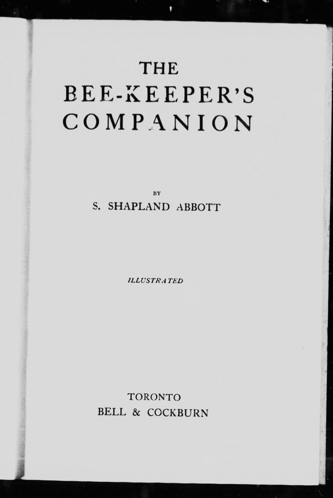

# Accessible IIIF Digitization

## Overview

This hands-on activity is designed to familiarize you with the Manifest Editor, developed by Digirati. It will provide you with the skills and knowledge needed to create your own no-code workflow for authoring IIIF manifests. It will also give you tips on what you can do to make your manifest accessible for people looking at your content with screen readers.&#x20;

## Tooling Used

### Bytescale

[Bytescale ](https://www.bytescale.com/)is a platform that enables uploading, processing, and hosting of images, videos, and audio files, with real-time media optimization and global content delivery, ideal for managing media content in web applications.​&#x20;

This is where you can upload IIIF files to and basically have an API – meaning you can save their work to Bytescale and then view it in IIIF viewers etc.

This service offers a free trial, but eventually costs around $7 a month. Any file hosting service that provides 'direct download links' can be used for this, but Bytescale offered the simplest user experience. Unfortunately, there's no easy way to use google docs for this.

You will need to create a free trial Bytescale account before continuing on to the activity.

### DocuPanda

[DocuPanda ](https://www.docupanda.io/)is an AI-powered document processing platform that transforms various document formats into structured, searchable data to enable efficient data extraction and analysis.​ DocuPanda allows free accounts with limits to how many images you can scan.

You can use it during the activity, or you can elect to create the text describing the contents of your IIIF image manually.

If you choose to use DocuPanda, you will need to create a free account before continuing on to the activity.

### Manifest Editor

[The Digirati Manifest Editor](https://manifest-editor.digirati.services/) is a user-friendly, web-based platform for creating and editing IIIF manifests, enabling libraries, museums, and other institutions to organize and display multimedia collections with customizable metadata and viewing options.​

### Theseus

[Theseus Viewer](https://theseusviewer.org/) is a IIIF-compliant platform that allows users to view, navigate, and interact with digital collections of images, audio, and video, especially in the context of cultural heritage and research applications.​

Theseus is very beginner friendly, will allow you to share your content with others, and also has wide support for the various features IIIF provides.

## Instructions

### Take a Photo

Take an photo, or multiple photos, of something you would like to digitize.

For example, an image of a book title page:

<figure><figcaption>
An image of a scanned book title page
</figcaption></figure>

### Host the Photo on the Web

Now, upload the image file to the file hosting app, we are using [Bytescale](https://www.bytescale.com/).

First, login:

<figure><figcaption></figcaption></figure>

Now you'll see your dashboard. Press the blue 'Upload' button to upload your image.

<figure><figcaption></figcaption></figure>

Now you'll see your image in the list of content:

<figure><figcaption></figcaption></figure>

### Grab the Photo's Direct Download Link

Click your photo, then you'll see the content of the right hand menu change. This is where you will see the 'direct download link' under the 'File URL' heading.&#x20;

Press the copy button preside the URL:

<figure><figcaption></figcaption></figure>

### Transcribe/Describe your Photo

Create a text representation of the photo. You can do this manually or try an OCR tool like [DocuPanda ](https://www.docupanda.io/auth/signin)to generate one if you are digitizing print materials. Today we will show you how to use DocuPanda.

First, login:

<figure><figcaption></figcaption></figure>

Now you'll see your dashboard:

<figure><figcaption></figcaption></figure>

Now, navigate to the documents page in the left hand menu:

<figure><figcaption></figcaption></figure>

Press the green upload button on the top right of the page, below the Account link.&#x20;

<figure><figcaption></figcaption></figure>

Then the upload menu will open on the right side of the screen:

<figure><figcaption></figcaption></figure>

Click upload files, use your file browser to open a file, then scroll down, and press submit:

<figure><figcaption></figcaption></figure>

After you press submit, DocuPanda will start analyzing your photo(s.) Then once it is done, the menu will update and show you a success message. Press the see documents button at the bottom:

<figure><figcaption></figcaption></figure>

Then you will see your files listed. Select your photo, then press the white 'download' button above the table:

<figure><figcaption></figcaption></figure>

A couple options will appear, click Text:

<figure><figcaption></figcaption></figure>

Now your text file representing the content of your photo will be on your computer, ready for the next step.

### Host the Text File on the Web

Go back to Bytescale, and now upload your text file:

<figure><figcaption></figcaption></figure>

### Grab the Text File's Direct Download Link

Use the copy button to grab the direct download link of your text file:

<figure><figcaption></figcaption></figure>

### Create the IIIF Manifest ​

Navigate to [The Digirati Manifest Editor](https://manifest-editor.digirati.services/) , and you will see the home page.

<figure><figcaption></figcaption></figure>

Press the big '+' create new manifest button. Now you will see a blank manifest editor:

<figure><figcaption></figcaption></figure>

First, you will want to provide a label for your manifest. This is rendered as the title of your document in IIIF viewers. In the right-hand side menu, replace 'Blank Manifest' with your document's title.&#x20;

<figure><figcaption></figcaption></figure>

Now add a summary containing a description of your document, and helpful accessibility related info. In the right-side menu, click the descriptive tab. Then, edit the summary field.

<figure><figcaption></figcaption></figure>

Press start adding content. Then a popup will show up. Click the 'Image from URL' option, which is the second in the list:

<figure><figcaption></figcaption></figure>

Now in the form, paste the direct download link to your photo:

<figure><figcaption></figcaption></figure>

Now press the create button, below the input, and you'll see your photo in your IIIF manifest, as a newly created canvas, the right hand side menu will now also show your canvas information:

<figure><figcaption></figcaption></figure>

Now, in that menu, label your canvas:

<figure><figcaption></figcaption></figure>

Now navigate to the 'Linking' tab in the canvas' right hand menu by clicking the more option:

<figure><figcaption></figcaption></figure>

From this tab, click 'Add Rendering' at the bottom:

<figure><figcaption></figcaption></figure>

Now, click the first option, Add a link to a Plaintext:

<figure><figcaption></figcaption></figure>

Paste the direct download link to your text file in the input, and press create:

<figure><figcaption></figcaption></figure>

Then you have a manifest which includes accessibility information in it's summary, and textual representation of the photo of the object you digitized! The text you attached in the rendering field will be displayed in the IIIF viewer in the following steps.

### Host your IIIF Manifest File on the Web

Now, you will want to save your IIIF manifest to your file hosting service. This will provide you with long term hosting of your IIIF manifest, as the editor only saves the data for a couple of months.

To host your manifest long term, save the completed manifest to your device by clicking the download icon:

<figure><figcaption></figcaption></figure>

Find your manifest file in your downloads, and rename it to something more descriptive:

<figure><figcaption></figcaption></figure>

Return to the file sharing app and upload your IIIF manifest file:

<figure><figcaption></figcaption></figure>

Now you can use the direct download link to your manifest in any IIIF tool or viewer!

### Open your Manifest in the Theseus Viewer&#x20;

Copy the direct download link to your manifest in Bytescale:

<figure><figcaption></figcaption></figure>

{% embed url="https://upcdn.io/kW15cD4/raw/IIIF%20Demo/beekeepers-companion.json" %}

Navigate to [Theseus Viewer's website](https://theseusviewer.org/), and you will see at the top left a form for opening your manifest. Paste the direct download link to your manifest in the input:

<figure><figcaption></figcaption></figure>

Then, press 'View Manifest' below the input. This will open your manifest in the Theseus Viewer:

<figure><figcaption></figcaption></figure>

A great thing about theseus is the skip links to important features it offers right away to users. Under the left hand menu's Overview section, click 'Read transcription.' This will display the textual representation you linked to your photo beside the photo:

<figure><figcaption></figcaption></figure>

If the document you created contained multiple photos, as the user navigates through your manifest document, the transcription will update to reflect the contents of the current page.

At this point, you can also download NVDA screen reader, and navigate through the manifest to see how someone using a screen reader would interact with your document.

Sharing your Manifest

Lastly, you can share your manifest to social media, friends, or colleagues using the Theseus viewer . To do so, simply copy the URL in your browser:

<figure><figcaption></figcaption></figure>

Check out my manifest in Theseus yourself using the URL from the browser that I copied:

{% embed url="https://theseusviewer.org/?iiif-content=https://upcdn.io/kW15cD4/raw/IIIF%20Demo/beekeepers-companion.json" %}

## Summary

Now you have an example of how to digitize content, providing accessibility information in the document description, and transcriptions of photos for screen readers. You can use the information you learned today to come up with your own no-code workflow that best suits your content.

More work is being done to provide even better compatibility of textual representations of digitized photos within IIIF Manifests. Ideally, we would like to mark up images in manifests with highly structured HTML, to improve the experience of reading transcriptions with screen readers. If you are interested in discussing ideas like this, check out the #a11y channel on the IIIF Slack! [(Get an invite to the Slack here)](https://docs.google.com/forms/d/e/1FAIpQLSdGV9QSFo8i2z1R5iIMP7B2JVhS9akHqcykWF5\_y4mtWqVrBA/viewform)

## Feedback

Press the '+' button on the bottom-right to contribute your feedback!


