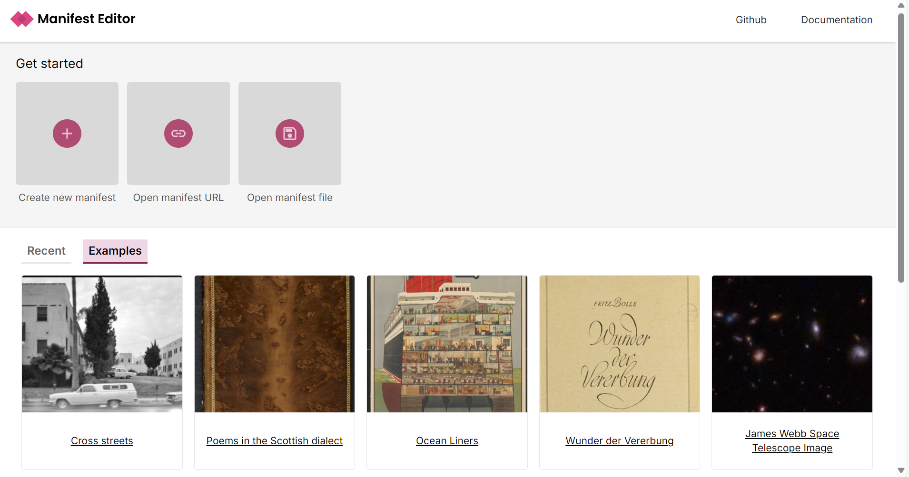

# Accessible IIIF Digitization

## Overview

Join us for workshop designed to familiarize you with the Manifest Editor, developed by Digirati. This hands-on activity will provide you with the skills and knowledge needed to create your own no-code workflow authoring IIIF manifests that can be used by people looking at your content with screen readers.&#x20;

## Tooling Used

### Bytescale

[Bytescale ](https://www.bytescale.com/)is a platform that enables uploading, processing, and hosting of images, videos, and audio files, with real-time media optimization and global content delivery, ideal for managing media content in web applications.​&#x20;

This is where you can upload IIIF files to and basically have an API – meaning you can save their work to Bytescale and then view it in IIIF viewers etc.

This service offers a free trial, but eventually costs around $7 a month. Any file hosting service that provides 'direct download links' can be used for this, but Bytescale offered the simplest user experience. Unfortunately, there's no easy way to use google docs for this.

You will need to create a free trial Bytescale account before continuing on to the activity.

### DocuPanda

[DocuPanda ](https://www.docupanda.io/)is an AI-powered document processing platform that transforms various document formats into structured, searchable data to enable efficient data extraction and analysis.​ DocuPanda allows free accounts with limits to how many images you can scan.

You can use it during the activity, or you can elect to create the text describing the contents of your IIIF image manually.

If you choose to use DocuPanda, you will need to create a free account before continuing on to the activity.

### Manifest Editor

[The Digirati Manifest Editor](https://manifest-editor.digirati.services/) is a user-friendly, web-based platform for creating and editing IIIF manifests, enabling libraries, museums, and other institutions to organize and display multimedia collections with customizable metadata and viewing options.​

### Theseus

[Theseus Viewer](https://theseusviewer.org/) is a IIIF-compliant platform that allows users to view, navigate, and interact with digital collections of images, audio, and video, especially in the context of cultural heritage and research applications.​

Theseus is very beginner friendly, will allow you to share your content with others, and also has wide support for the various features IIIF provides.

## Instructions

### Take a Photo

Take an photo, or multiple photos, of something you would like to digitize.

For example, an image of a book title page:

<figure><figcaption>
An image of a scanned book title page
</figcaption></figure>

### Host the Photo on the Web

Now, upload the image file to the file hosting app, we are using [Bytescale](https://www.bytescale.com/).

First, login:

<figure><figcaption></figcaption></figure>

Now you'll see your dashboard. Press the blue 'Upload' button to upload your image.

<figure><figcaption></figcaption></figure>

Now you'll see your image in the list of content:

<figure><figcaption></figcaption></figure>

### Grab the Image's Direct Download Link

Click your image, then you'll see the content of the right hand menu change. This is where you will see the 'direct download link' under the 'File URL' heading.&#x20;

Press the copy button preside the URL:

<figure><figcaption></figcaption></figure>

### Transcribe/Describe your Image

Create a text representation of the Image&#x20;

manually or try an OCR tool like DocuPanda to generate one if you are digitizing print materials

### Host the Text File on the Web

### Grab the Text File's Direct Download Link

### Creating the Manifest ​

Navigate to [The Digirati Manifest Editor](https://manifest-editor.digirati.services/) , and you will see the home page.

Press the +create manifest button.

[https://upcdn.io/kW15cD4/raw/IIIF%20Demo/oocihm.80616.10.jpg](https://upcdn.io/kW15cD4/raw/IIIF%20Demo/oocihm.80616.10.jpg)

Use the copied image URL to add the image as a new canvas in your manifest ​

Provide a label for your manifest ​

Write a summary describing the content of the manifest  ​

Link the uploaded text file to the Manifest rendering property of the canvas in your manifest ​

Add label to rendering property that says “text representation”​

Save the completed manifest to your device ​

Rename the file​

### Host your IIIF Manifest File on the Web

Return to the file sharing app and upload your IIIF manifest file ​

### Open your Manifest in the Theseus Viewer&#x20;

Use a keyboard and screen reader to interact with your manifest in the viewer ​

Share the manifest to social media using the Theseus viewer ​

## Feedback

Press the '+' button on the bottom-right to contribute your feedback!


